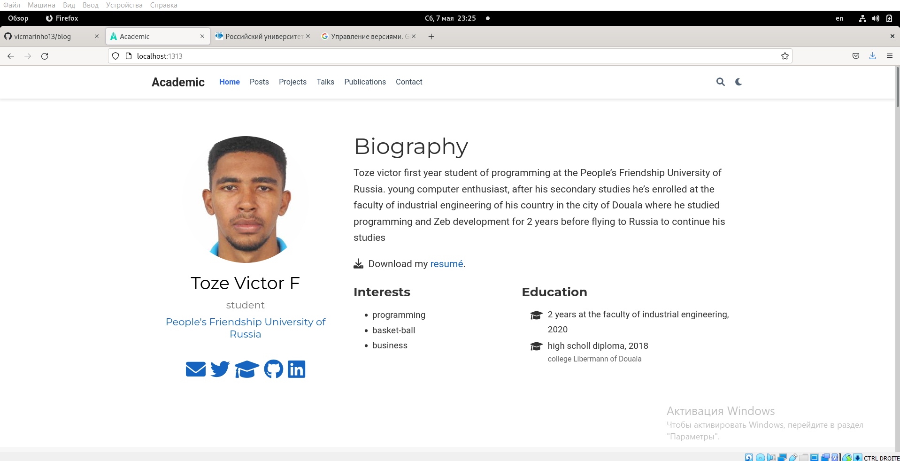

**РОССИЙСКИЙ УНИВЕРСИТЕТ ДРУЖБЫ НАРОДОВ**

**Факультет физико-математических и естественных наук**

**Кафедра прикладной информатики и теории вероятностей**

**ОТЧЕТ** 

**ПО ИНДИВИДУАЛЬНЫЙ ПРОЕКТ ЭТАП 2** 

*дисциплина:	Операционные системы* 	 

Студент:  Тозе Виктор Ф                                   

`	`Группа: НФИбд-02-21                                      

**МОСКВА**

2022	 г.

**Цель работы** 

Добавить к сайту данные о себе.

-Список добавляемых данных.

-Разместить фотографию владельца сайта.

-Разместить краткое описание владельца сайта (Biography).

-Добавить информацию об интересах (Interests).

-Добавить информацию от образовании (Education).

Сделать пост по прошедшей неделе.

Добавить пост на тему по выбору:

-Управление версиями. Git.

-Непрерывная интеграция и непрерывное развертывание (CI/CD).

**Ход работы**

Сначала открыли папку где расположена наш сайт “blog”

После этого открыли папку content>> authors>> admin и внутри изменили фото с нашим 

затем оекрыли “index.md” и изменили данных со своими 		

И так получилось создать сайт с моими информацией 

