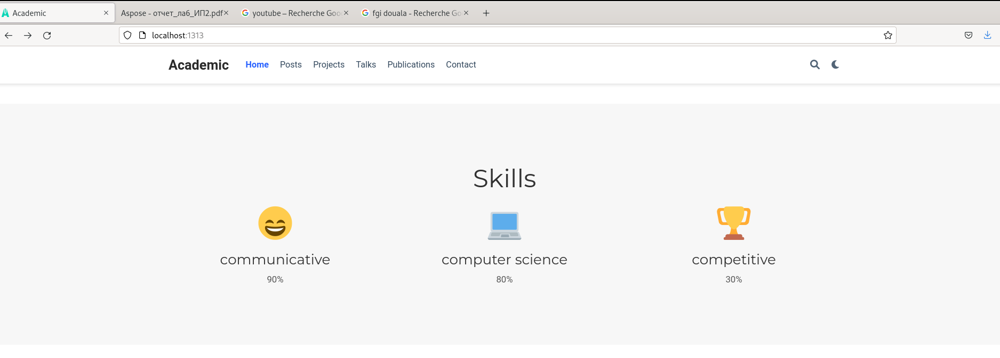
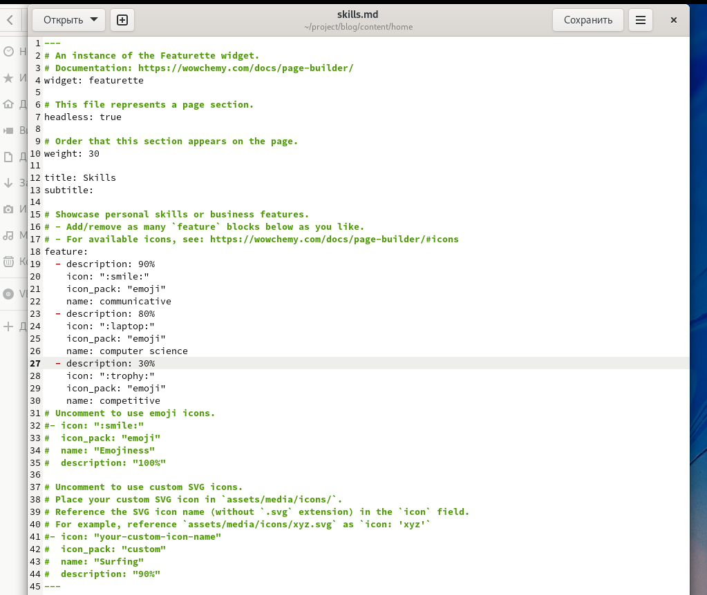
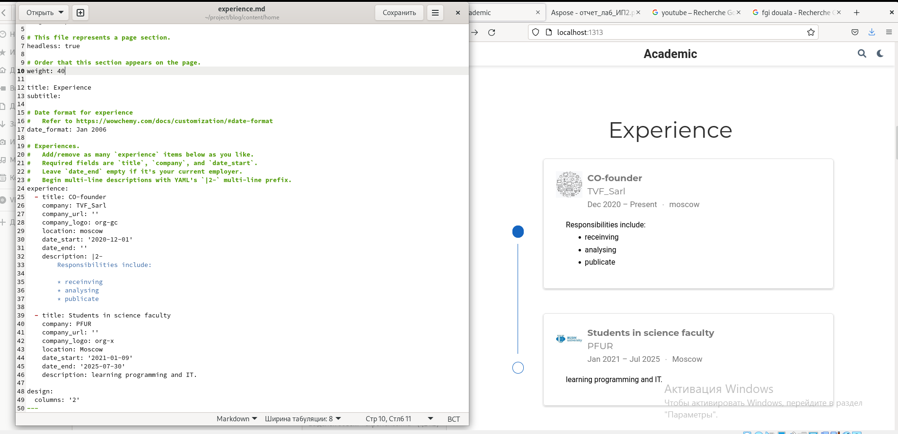
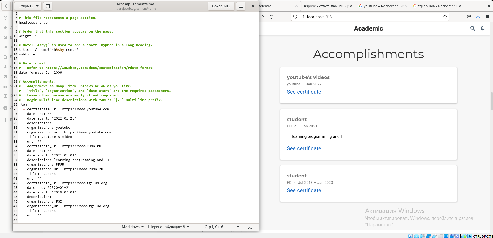
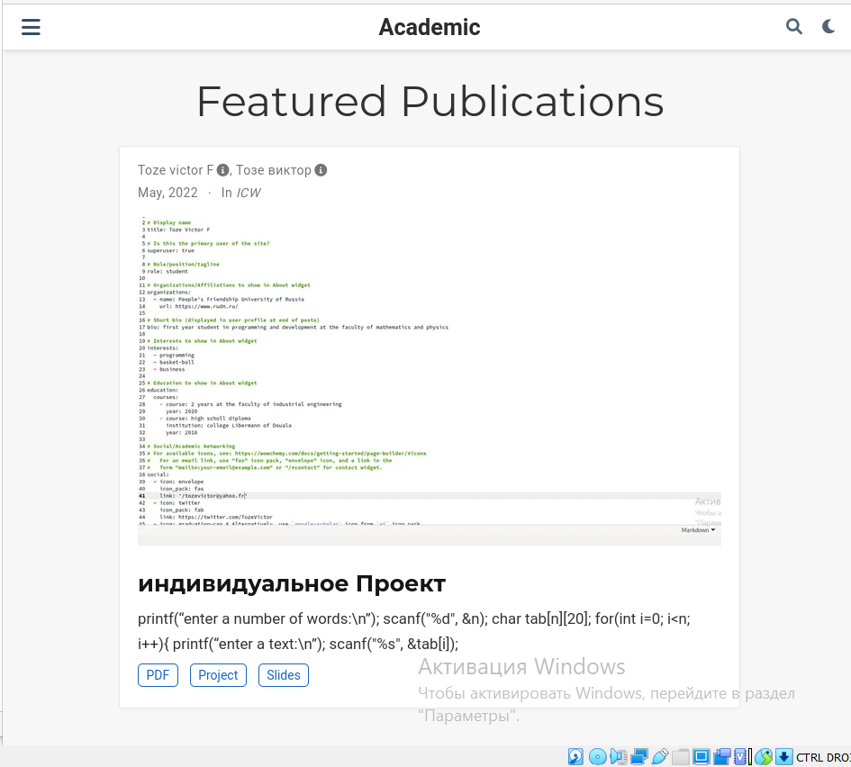

**РОССИЙСКИЙ УНИВЕРСИТЕТ ДРУЖБЫ НАРОДОВ**

**Факультет физико-математических и естественных наук**

**Кафедра прикладной информатики и теории вероятностей**

**ОТЧЕТ** 

**ПО ИНДИВИДУАЛЬНИЙ ПРОЕКТ 3-Й ЭТАП**

*дисциплина:	Операционные системы*	 

Студент:  Тозе Виктор Ф                                    

`	`Группа: НФИбд-02-21                                      

**МОСКВА**

2022	 г.

**Цель работы:**

добавить к сайту достижения.

Список достижений.

Добавить информацию о навыках (Skills).

Добавить информацию об опыте (Experience).

Добавить информацию о достижениях (Accomplishments).

Сделать пост по прошедшей неделе.

Добавить пост на тему по выбору:

Легковесные языки разметки.

Языки разметки. LaTeX.

Язык разметки Markdown.

**Ход работы**

добавили Информацию о навыках с помощью  файл Skills.md

после этого добавили информацию об опыте с помощью файл experience.md

Затем мы Добавили информацию о достижениях с помощью файл accomplishments.md

И наконец-то Сделали пост по прошедшей неделе, Добавить пост на тему 

Легковесные языки разметки C++

