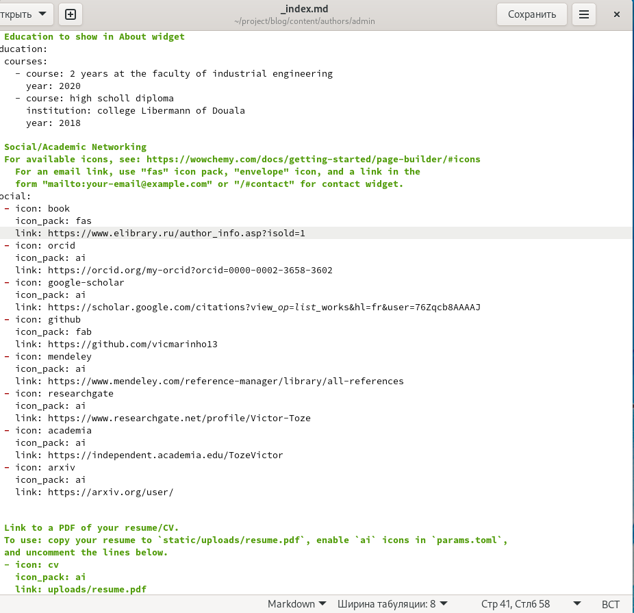
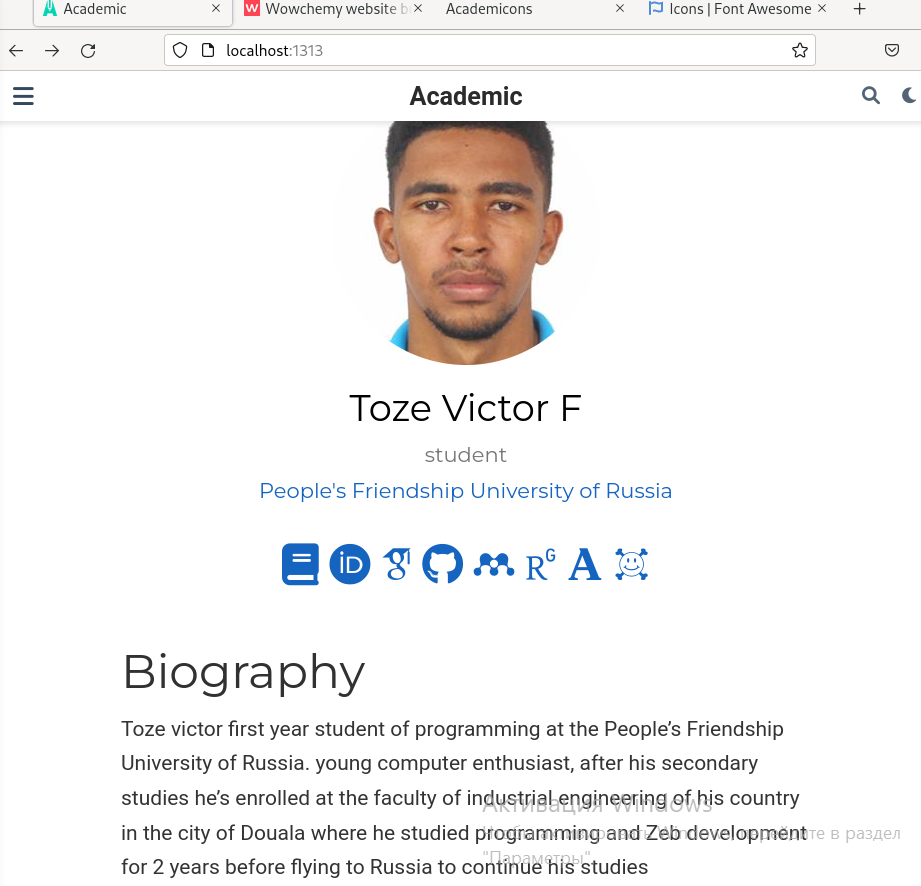
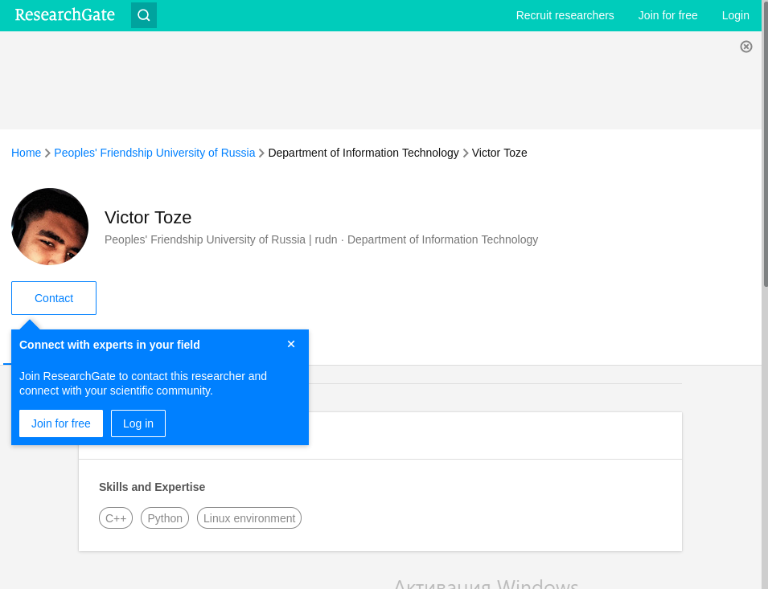
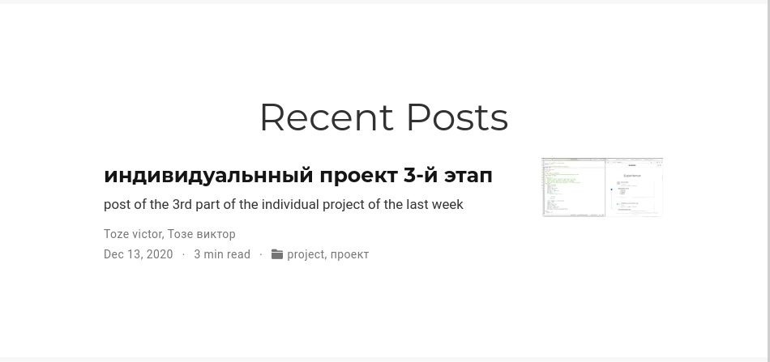
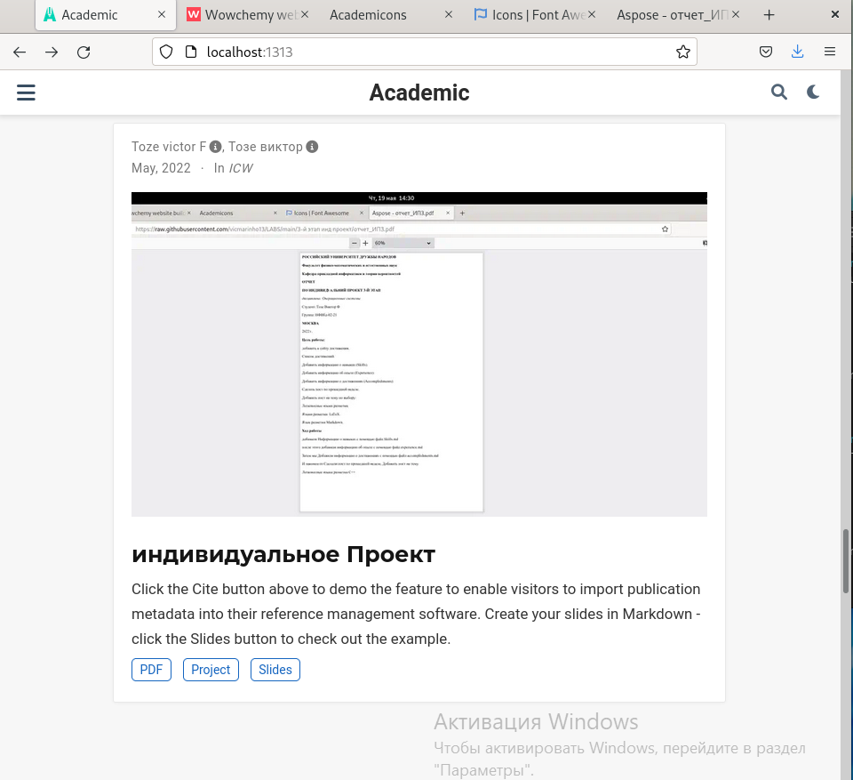

**РОССИЙСКИЙ УНИВЕРСИТЕТ ДРУЖБЫ НАРОДОВ**

**Факультет физико-математических и естественных наук**

**Кафедра прикладной информатики и теории вероятностей**

**ОТЧЕТ** 

**ПО ИНДИВИДУАЛЬНЫЙ ПРОЕКТ ЭТАП 4**	

*дисциплина:	Операционные системы* 

Студент:   Тозе Виктор Ф                                 

`	`Группа: НФИбд-02-21                                      

**МОСКВА**

2022	 г.

**Цель работы:**

**Добавить к сайту ссылки на научные и библиометрические ресурсы**.

**Зарегистрироваться на соответствующих ресурсах и разместить на них ссылки на сайте:**

eLibrary : https://elibrary.ru/;

Google Scholar : https://scholar.google.com/;

ORCID : https://orcid.org/;

Mendeley : https://www.mendeley.com/;

ResearchGate : https://www.researchgate.net/;

Academia.edu : https://www.academia.edu/;

arXiv : https://arxiv.org/;

github : https://github.com/.

**Сделать пост по прошедшей неделе.**

**Добавить пост на тему по выбору:**

Оформление отчёта.

Создание презентаций.

Работа с библиографией.

**Ход работы**

Добавили к сайту ссылки на научные и библиометрические ресурсы.

Зарегистрировались на соответствующих ресурсах и разместили на них ссылки на сайте:

С помощью файл index.md мы смогли изменить все “icon” и разместить ссылки 

получилось такая же страница, где мы видим все иконки 

Когда нажмем например на икону “ResearchGate” получаем такая станица означает что ссылка хорошо работает

Сделали пост по прошедшей неделе

Добавили пост на тему по выбору:

Оформление отчёта.
