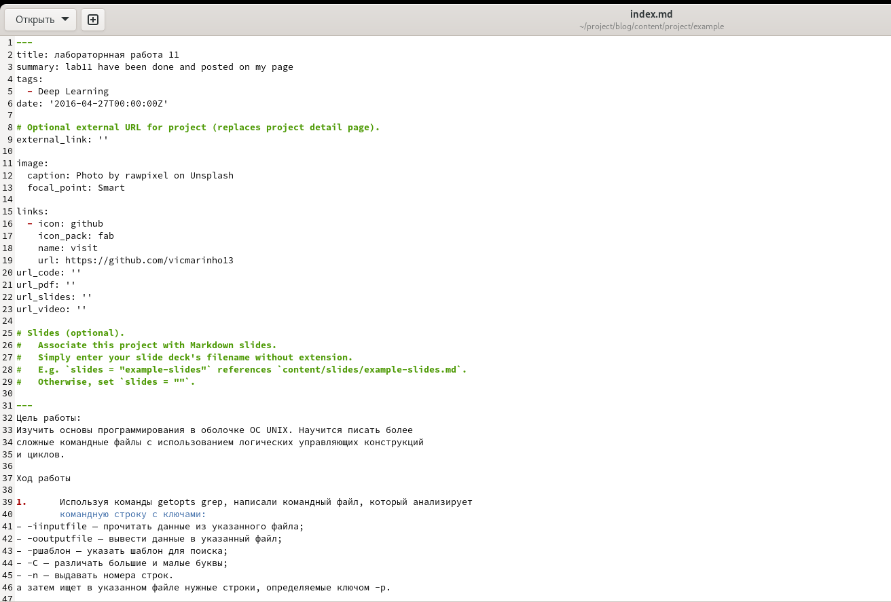
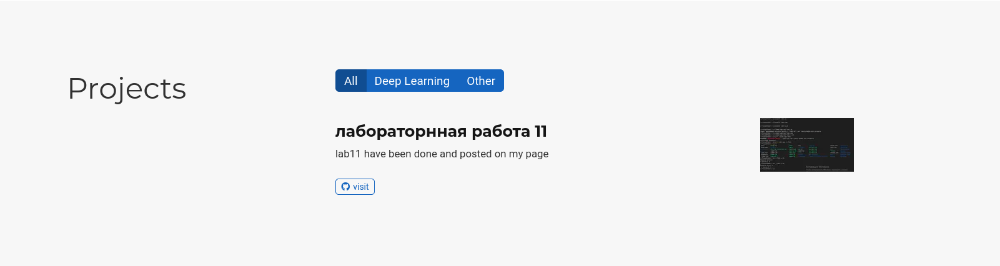
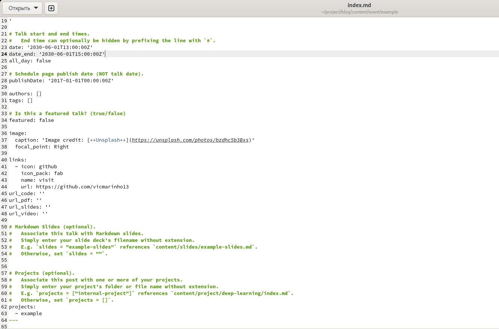
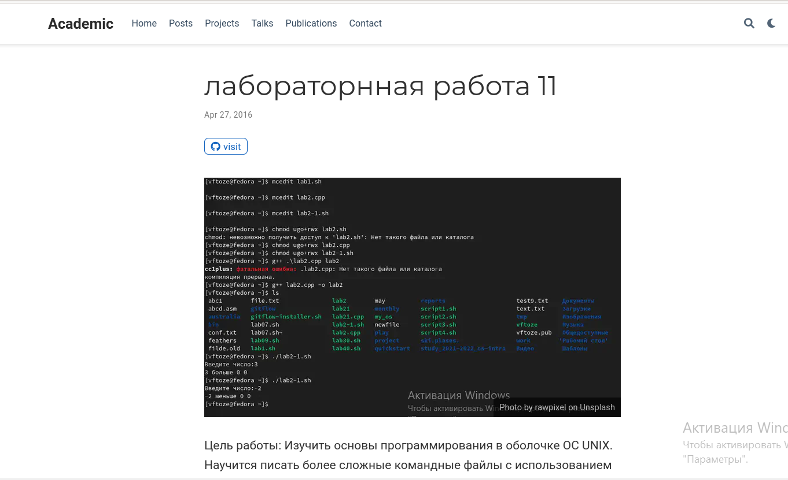
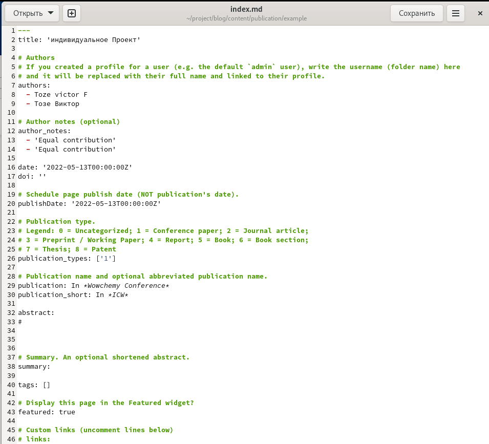
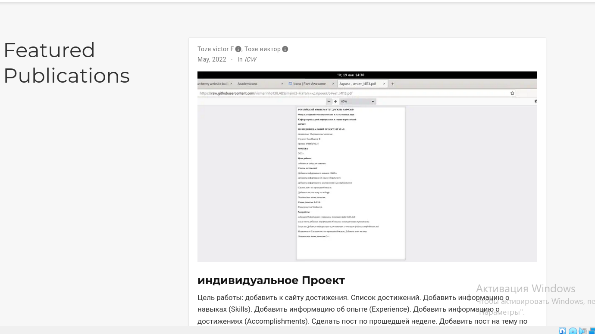
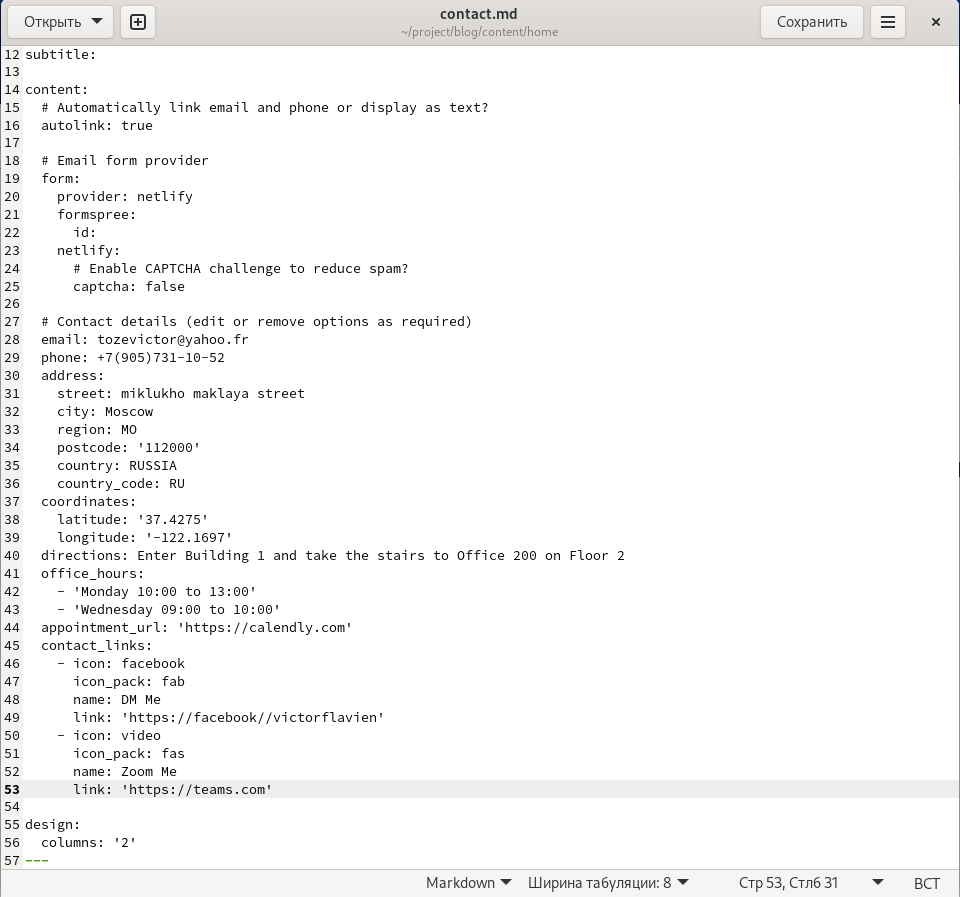
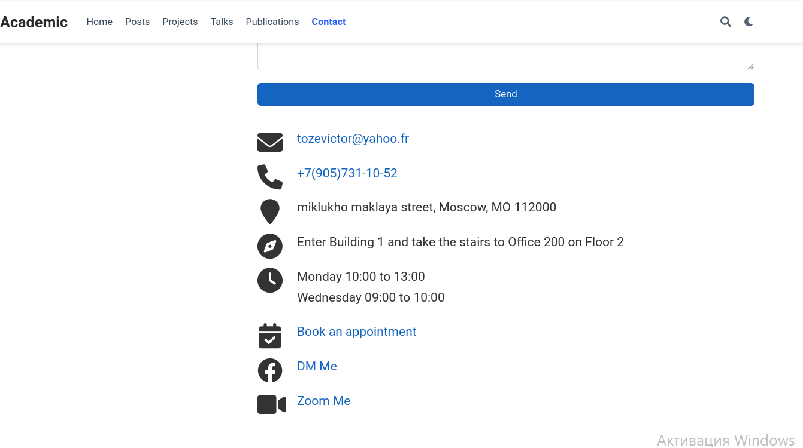

**РОССИЙСКИЙ УНИВЕРСИТЕТ ДРУЖБЫ НАРОДОВ**

**Факультет физико-математических и естественных наук**

**Кафедра прикладной информатики и теории вероятностей**

**ОТЧЕТ** 

**ПО ИНДИВИДУАЛЬНОМУ ПРОЕКТУ ЭТАП 5**

*дисциплина:	Операционные системы* 

Студент:  Тозе Виктор Ф                                   

`	`Группа:  НФИбд-02-21                                     

**МОСКВА**

2022	 г.

**Цель работы:**

**Добавить с сайту все остальные элементы**.

Сделать записи для персональных проектов.

Сделать пост по прошедшей неделе.

Добавить пост на тему по выбору.

Языки научного программирования

**Ход работы**

**Добавили с сайту все остальные элементы**

**-** добавили нашей информации в разделе “project”.

**-** добавили нашей информации в разделе “talk”.

Когда открываем “project” получаем:

\- добавили нашей информации в разделе “featured publication”.

\- добавили нашей информации в разделе “contact”.

