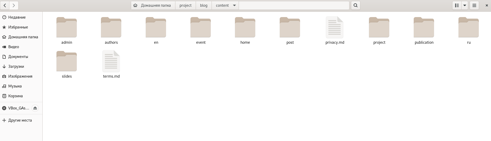
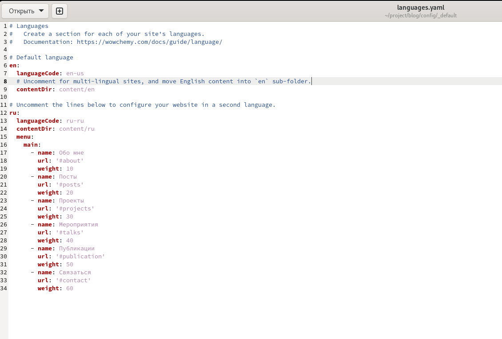
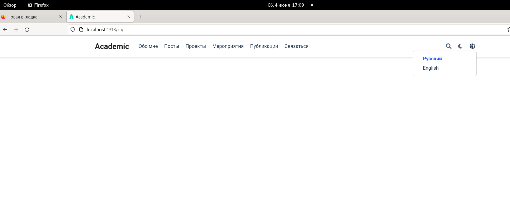
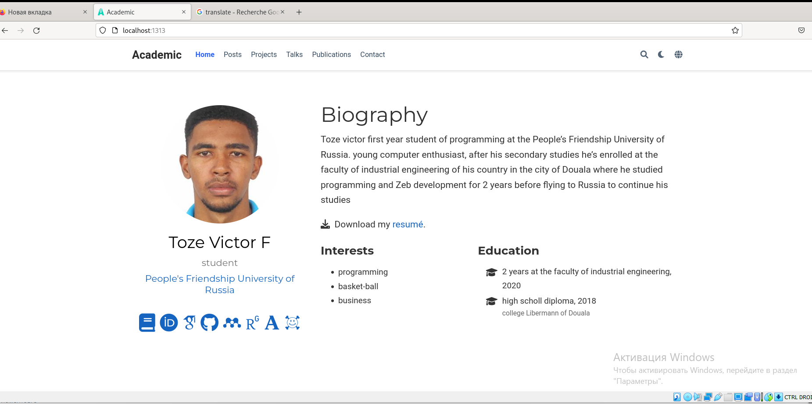
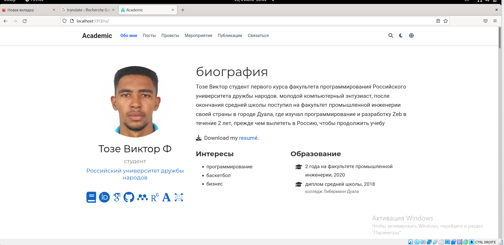
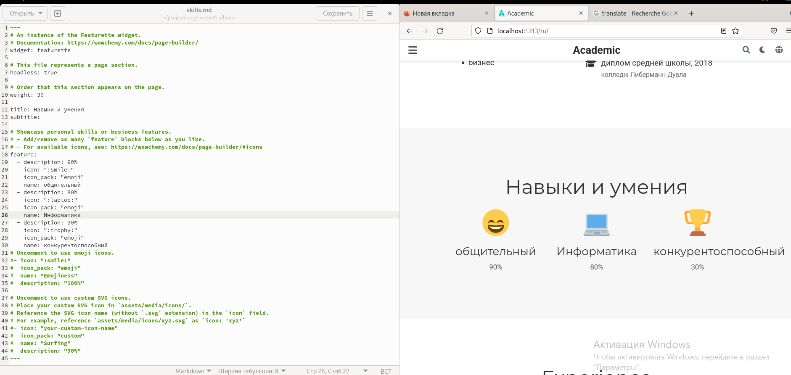
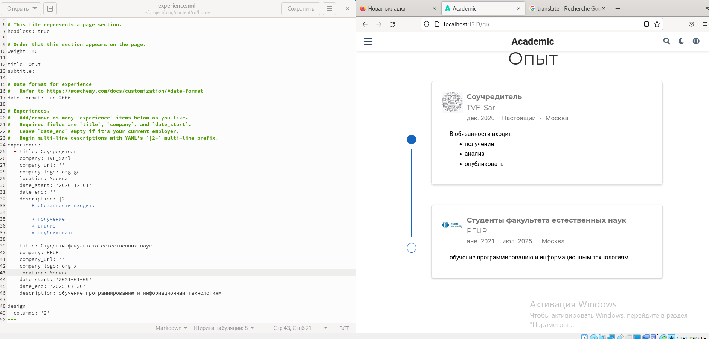
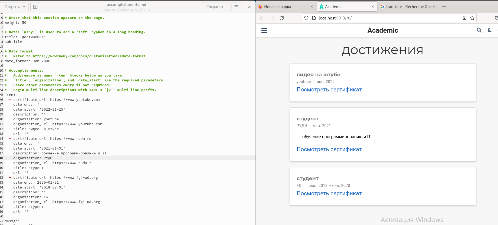
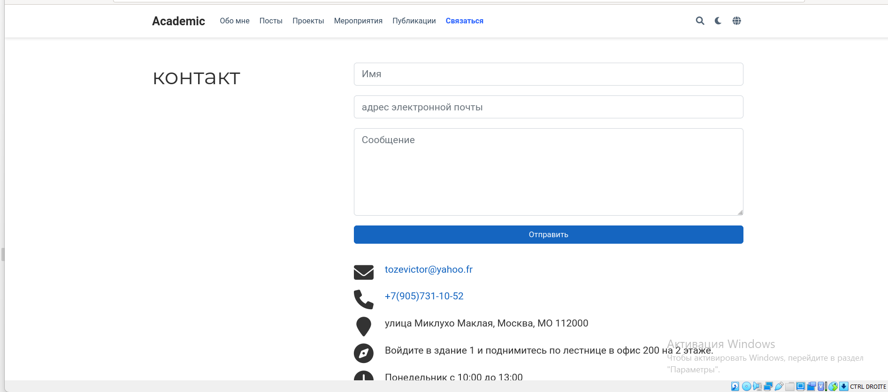
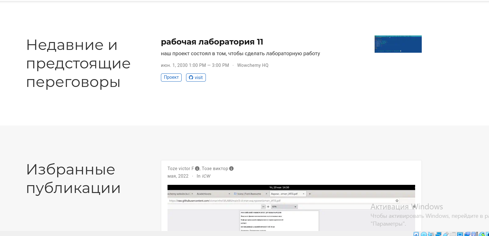

**РОССИЙСКИЙ УНИВЕРСИТЕТ ДРУЖБЫ НАРОДОВ**

**Факультет физико-математических и естественных наук**

**Кафедра прикладной информатики и теории вероятностей**

**ОТЧЕТ** 

**ПО ИНДИВИДУАЛЬНОМУ ПРОЕКТУ ЭТАП 6**

*дисциплина:	Операционные системы*	 

Студент:  Тозе Виктор Ф                                   

`	`Группа: НФИбд-02-21                                      

**МОСКВА**

2022	 г.

**Цель работы:**

Размещение двуязычного сайта на Github.

**М**ы сначала создали папку -en для английского языка и папку -ru для Русского языка и внутри скопировали все папки которые были в папке -content

После этого открыли файл /project/blog/config/\_default где мы изменили параматры

Получили такую заголовку на Русском языке

Затем сделали поддержку английского и русского языков. Разместили элементы сайта на обоих языках и разместили контент на обоих языках.

Раздел “Skills” на русском

Раздел “experience” на русском

Раздел “accomplishments” на русском

Раздел “contact” на русском

Раздел “recents & upcoming talks” и “featured publications” на русском

