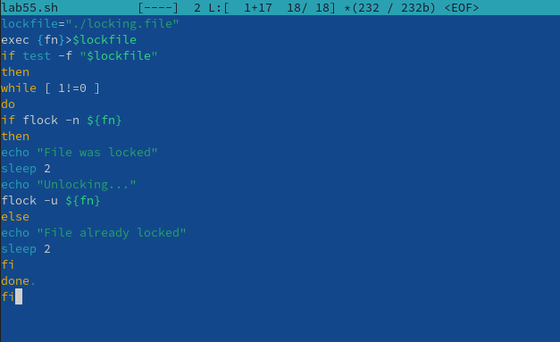
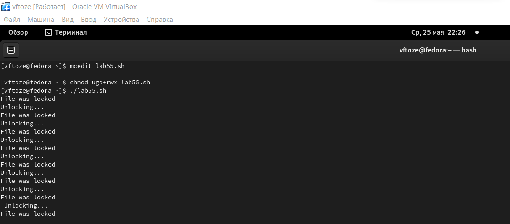
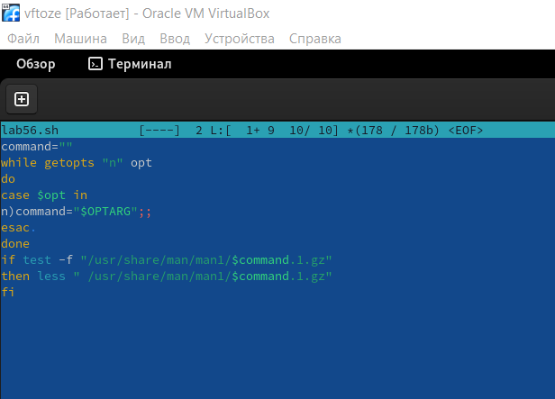
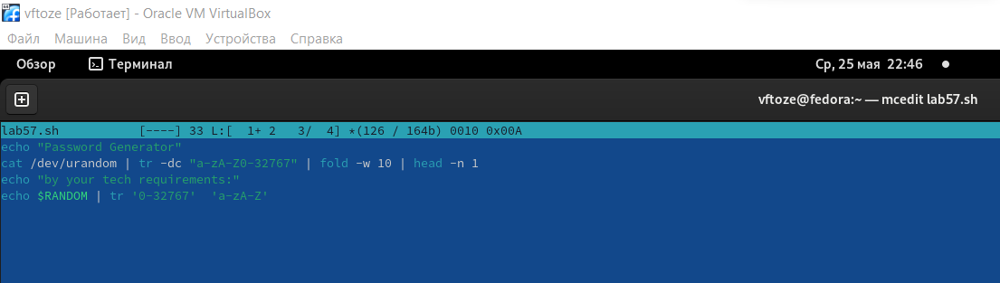
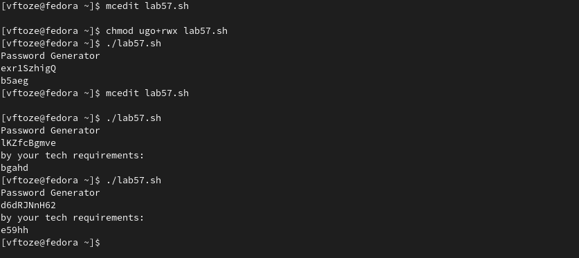

**РОССИЙСКИЙ УНИВЕРСИТЕТ ДРУЖБЫ НАРОДОВ**

**Факультет физико-математических и естественных наук**

**Кафедра прикладной информатики и теории вероятностей**

**ОТЧЕТ** 

**ПО ЛАБОРАТОРНОЙ РАБОТЕ № 12**	

*дисциплина:	Операционные системы*

Студент:    Тозе Виктор Ф                                 

`	`Группа: НФИбд-02-21                                       

**МОСКВА**

2022	 г.

**Цель работы:**

Изучить основы программирования в оболочке ОС UNIX. Научиться писать более

сложные командные файлы с использованием логических управляющих конструкций

и циклов**.**

**Ход работы**

1. Написали командный файл, реализующий упрощённый механизм семафоров. Командный файл должен в течение некоторого времени t1 дожидаться освобождения ресурса, выдавая об этом сообщение, а дождавшись его освобождения, использовать его в течение некоторого времени t2<>t1, также выдавая информацию о том, что ресурс используется соответствующим командным файлом (процессом). Запустили командный файл в одном виртуальном терминале в фоновом режиме, перенаправив его вывод в другой (> /dev/tty#, где # — номер терминала куда перенаправляется вывод), в котором также запущен этот файл, но не фоновом, а в привилегированном режиме. Доработали программу так, чтобы имелась возможность взаимодействия трёх и более процессов

результат получился в следующим образом 	

1. Реализовали команду man с помощью командного файла. Изучили содержимое каталога /usr/share/man/man1. В нем находятся архивы текстовых файлов, содержащих справку по большинству установленных в системе программ и команд. Каждый архив можно открыть командой less сразу же просмотрев содержимое справки. Командный файл должен получать в виде аргумента командной строки название команды и в виде результата выдавать справку об этой команде или сообщение об отсутствии справки, если соответствующего файла нет в каталоге man1

1. Используя встроенную переменную $RANDOM, написали командный файл, генерирующий случайную последовательность букв латинского алфавита. Учтите, что $RANDOM выдаёт псевдослучайные числа в диапазоне от 0 до 32767.

Результат, мы создали генератор паролей

**Вывод**

В ходе лабораторной работы я из изучил основы программирования в оболочке OC UNIX, научился писать более сложные командные файлы с использованием логических управляющих конструкций и циклов.

**Контрольные вопросы**

1: Найдите синтаксическую ошибку в следующей строке: while [$1 != "exit"]

$1. Так же между скобками должны быть пробелы. В противном случае скобки и рядом стоящие символы будут восприниматься как одно целое

2: Как объединить (конкатенация) несколько строк в одну?

cat file.txt | xargs | sed -e 's/. /.\n/g'

3: Найдите информацию об утилите seq. Какими иными способами можно реализовать её функционал при программировании на bash?

seq - выдает последовательность чисел. Реализовать ее функционал можно командой for n in {1..5} do <КОМАНДА> done

4: Какой результат даст вычисление выражения $((10/3))?

3

5: Укажите кратко основные отличия командной оболочки zsh от bash.

Zsh очень сильно упрощает работу. Но существуют различия. Например, в zsh после for обязательно вставлять пробел, нумерация массивов в zsh начинается с 1 (что не особо удобно на самом деле). Если вы собираетесь писать скрипт, который легко будет запускать множество разработчиков, то я рекомендуется Bash. Если скрипты вам не нужны - Zsh (более простая работа с файлами, например)

6: Проверьте, верен ли синтаксис данной конструкции for ((a=1; a <= LIMIT; a++))

Верен

7: Сравните язык bash с какими-либо языками программирования. Какие преимущества у bash по сравнению с ними? Какие недостатки?

Bash позволяет очень легко работать с файловой системой без лишних конструкций (в отличи от обычного языка программирования). Но относительно обычных языков программирования bash очень сжат. Тот же Си имеет гораздо более широкие возможности для разработчика.

