**РОССИЙСКИЙ УНИВЕРСИТЕТ ДРУЖБЫ НАРОДОВ**

**Факультет физико-математических и естественных наук**

**Кафедра прикладной информатики и теории вероятностей**

**ОТЧЕТ** 

**ПО ЛАБОРАТОРНОЙ РАБОТЕ № 	13**

*дисциплина:	Операционные системы*

Студент: Тозе Виктор Ф                                    

`	`Группа:  НФИбд-02-21                                     

**МОСКВА**

2022	 г.

**Цель работы:**	

Приобрести простейшие навыки разработки, анализа, тестирования и отладки приложений в ОС типа UNIX/Linux на примере создания на языке программирования С калькулятора с простейшими функциями.

**Ход работы:**

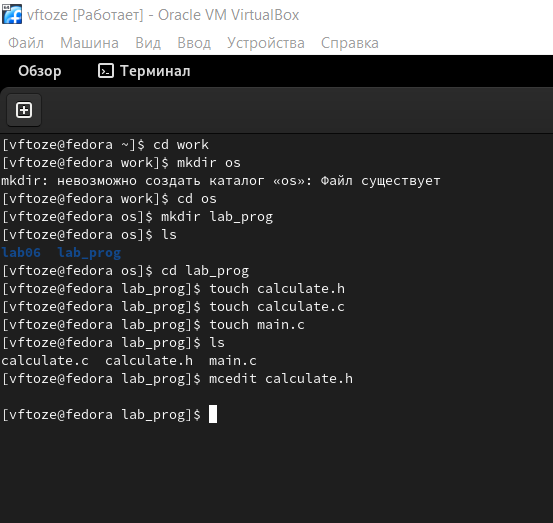В домашнем каталоге создали подкаталог ~/work/os/lab\_prog и создали в нём файлы: calculate.h, calculate.c, main.c.

Интерфейсный файл calculate.h, описывающий формат вызова функции калькулятор

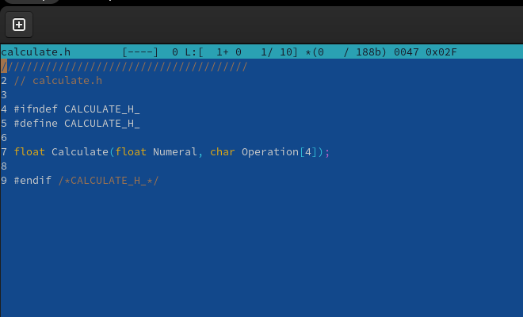	

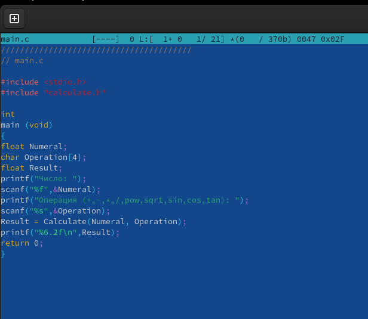Основной файл main.c, реализующий интерфейс пользователя к калькулятору:

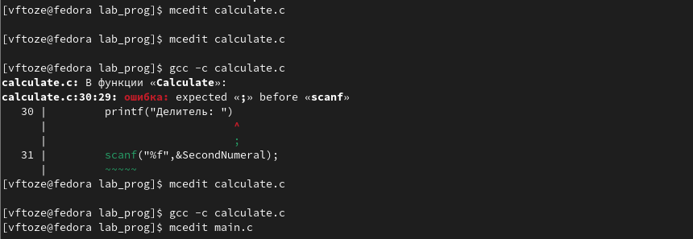 Выполните компиляцию программы посредством gcc:

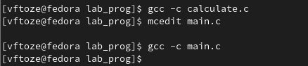

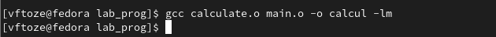

С помощью gdb выполнили отладку программы calcul 

– Запустили отладчик GDB, загрузив в него программу для отладки:

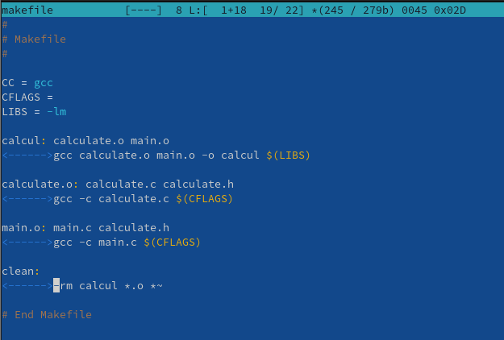

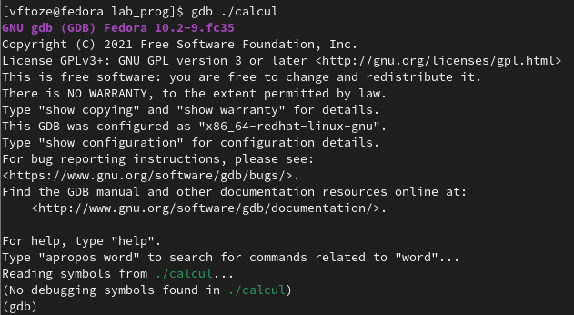

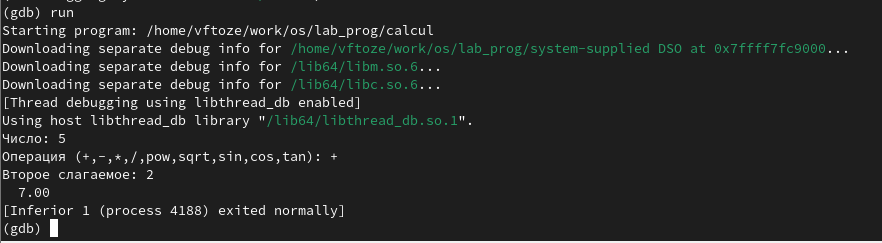

Для запуска программы внутри отладчика введите команду run

\- Для постраничного (по 9 строк) просмотра исходного код использовали команду list:

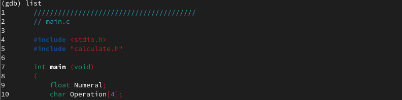

– Для просмотра строк с 12 по 15 основного файла использовали list с параметрами

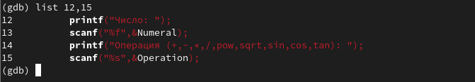

Установили точку останова в файле calculate.c на строке номер 21:

С помощью утилиты splint попробуйте проанализировали коды файлов calculate.c

и main.c.

**Вывод**

я приобрел простейшие навыки разработки, анализа, тестирования и откладки приложений в ОС типа UNIX/LINUX  на примере создания на языке программирования С калькулятора с простейшими функциями 

Контрольные вопросы

Как получить более полную информацию о программах: gcc, make, gdb и др.?
Дополнительную информацию о этих программах можно получить с помощью функций info и man.
Назовите и дайте краткую характеристику основным этапам разработки приложений в UNIX? Unix поддерживает следующие основные этапы разработки приложений:
создание исходного кода программы;
представляется в виде файла;
сохранение различных вариантов исходного текста;
анализ исходного текста; Необходимо отслеживать изменения исходного кода, а также при работе более двух программистов над проектом программы нужно, чтобы они не делали изменений кода в одно время.
компиляция исходного текста и построение исполняемого модуля;
тестирование и отладка;
проверка кода на наличие ошибок
сохранение всех изменений, выполняемых при тестировании и отладке.
Что такое суффиксы и префиксы? Основное их назначение. Приведите примеры их использования.
Использование суффикса ".с" для имени файла с программой на языке Си отражает удобное и полезное соглашение, принятое в ОС UNIX. Для любого имени входного файла суффикс определяет какая компиляция требуется. Суффиксы и префиксы указывают тип объекта. Одно из полезных свойств компилятора Си — его способность по суффиксам определять типы файлов. По суффиксу .c компилятор распознает, что файл abcd.c должен компилироваться, а по суффиксу .o, что файл abcd.о является объектным модулем и для получения исполняемой программы необходимо выполнить редактирование связей. Простейший пример командной строки для компиляции программы abcd.c и построения исполняемого модуля abcd имеет вид: gcc -o abcd abcd.c.Некоторые проекты предпочитают показывать префиксы в начале текста изменений для старых (old) и новых (new) файлов. Опция – prefix может быть использована для установки такого префикса. Плюс к этому команда bzr diff -p1 выводит префиксы в форме которая подходит для команды patch -p1.
Основное назначение компилятора с языка Си в UNIX?
Основное назначение компилятора с языка Си заключается в компиляции всей программы в целом и получении исполняемого модуля.
Для чего предназначена утилика make.
При разработке большой программы, состоящей из нескольких исходных файлов заголовков, приходится постоянно следить за файлами, которые требуют перекомпиляции после внесения изменений. Программа make освобождает пользователя от такой рутинной работы и служит для документирования взаимосвязей между файлами. Описание взаимосвязей и соответствующих действий хранится в так называемом make-файле, который по умолчанию имеет имя makefile или Makefile.
Приведите структуру make-файла. Дайте характеристику основным элементам этого файла.
makefile для программы abcd.c мог бы иметь вид:
#
#
Makefile
#
CC = gcc
CFLAGS =
LIBS = -lm
calcul: calculate.o main.o gcc calculate.o main.o -o calcul $(LIBS) calculate.o: calculate.c calculate.h gcc -c calculate.c $(CFLAGS) main.o: main.c calculate.h gcc -c main.c $(CFLAGS) clean: -rm calcul *.o *~
#End Makefile 

В общем случае make-файл содержит последовательность записей (строк), определяющих зависимости между файлами. Первая строка записи представляет собой список целевых (зависимых) файлов, разделенных пробелами, за которыми следует двоеточие и список файлов, от которых зависят целевые. Текст, следующий за точкой с запятой, и все последующие строки, начинающиеся с литеры табуляции, являются командами OC UNIX, которые необходимо выполнить для обновления целевого файла. Таким образом, спецификация взаимосвязей имеет формат: target1 [ target2...]: [:] [dependment1...] [(tab)commands] [#commentary] [(tab)commands][#commentary], где # — специфицирует начало комментария, так как содержимое строки, начиная с # и до конца строки, не будет обрабатываться командой make; : — последовательность команд ОС UNIX должна содержаться в одной строке make-файла (файла описаний), есть возможность переноса команд (), но она считается как одна строка; :: — последовательность команд ОС UNIX может содержаться в нескольких последовательных строках файла описаний. Приведённый выше make-файл для программы abcd.c включает два способа компиляции и построения исполняемого модуля. Первый способ предусматривает обычную компиляцию с построением исполняемого модуля с именем abcd. Второй способ позволяет включать в исполняемый модуль testabcd возможность выполнить процесс отладки на уровне исходного текста.
Назовите основное свойство, присущее всем программам отладки. Что необходимо сделать, чтобы его можно было использовать?
Пошаговая отладка программ заключается в том, что выполняется один оператор программы и, затем контролируются те переменные, на которые должен был воздействовать данный оператор. Если в программе имеются уже отлаженные подпрограммы, то подпрограмму можно рассматривать, как один оператор программы и воспользоваться вторым способом отладки программ. Если в программе существует достаточно большой участок программы, уже отлаженный ранее, то его можно выполнить, не контролируя переменные, на которые он воздействует. Использование точек останова позволяет пропускать уже отлаженную часть программы. Точка останова устанавливается в местах, где необходимо проверить содержимое переменных или просто проконтролировать, передаётся ли управление данному оператору. Практически во всех отладчиках поддерживается это свойство (а также выполнение программы до курсора и выход из подпрограммы). Затем отладка программы продолжается в пошаговом режиме с контролем локальных и глобальных переменных, а также внутренних регистров микроконтроллера и напряжений на выводах этой микросхемы. 8. Назовите и дайте основную характеристику основным командам отладчика gdb. – backtrace – выводит весь путь к текущей точке останова, то есть названия всех функций, начиная от main(); иными словами, выводит весь стек функций; – break – устанавливает точку останова; параметром может быть номер строки или название функции;
clear – удаляет все точки останова на текущем уровне стека (то есть в текущей функции);
continue – продолжает выполнение программы от текущей точки до конца;
delete – удаляет точку останова или контрольное выражение;
display – добавляет выражение в список выражений, значения которых отображаются каждый раз при остановке программы;
finish – выполняет программу до выхода из текущей функции; отображает возвращаемое значение,если такое имеется;
info breakpoints – выводит список всех имеющихся точек останова; – info watchpoints – выводит список всех имеющихся контрольных выражений;
splist – выводит исходный код; в качестве параметра передаются название файла исходного кода, затем, через двоеточие, номер начальной и конечной строки; – next – пошаговое выполнение программы, но, в отличие от команды step, не выполняет пошагово вызываемые функции;
print – выводит значение какого-либо выражения (выражение передаётся в качестве параметра);
run – запускает программу на выполнение;
set – устанавливает новое значение переменной
step – пошаговое выполнение программы;
watch – устанавливает контрольное выражение, программа остановится, как только значение контрольного выражения изменится;
Опишите по шагам схему отладки программы которую вы использовали при выполнении лабораторной работы.
Выполнили компиляцию программы
Увидели ошибки в программе
Открыли редактор и исправили программу
Загрузили программу в отладчик gdb
run — отладчик выполнил программу, мы ввели требуемые значения.
программа завершена, gdb не видит ошибок.
Прокомментируйте реакцию компилятора на синтаксические ошибки в программе при его первом запуске.
1 и 2.) Мы действительно забыли закрыть комментарии; 3.) отладчику не понравился формат %s для &Operation, т.к %s — символьный формат, а значит необходим только Operation.
Назовите основные средства, повышающие понимание исходного кода программы. Если вы работаете с исходным кодом, который не вами разрабатывался, то назначение различных конструкций может быть не совсем понятным. Система разработки приложений UNIX предоставляет различные средства, повышающие понимание исходного кода. К ним относятся: – cscope - исследование функций, содержащихся в программе; – splint — критическая проверка программ, написанных на языке Си.
Каковы основные задачи, решаемые программой slint?
Проверка корректности задания аргументов всех использованных в программе функций, а также типов возвращаемых ими значений;
Поиск фрагментов исходного текста, корректных с точки зрения синтаксиса языка Си, но малоэффективных с точки зрения их реализации или содержащих в себе семантические ошибки;
Общая оценка мобильности пользовательской программы.
