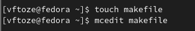

**РОССИЙСКИЙ УНИВЕРСИТЕТ ДРУЖБЫ НАРОДОВ**

**Факультет физико-математических и естественных наук**

**Кафедра прикладной информатики и теории вероятностей**

**ОТЧЕТ** 

**ПО ЛАБОРАТОРНОЙ РАБОТЕ № 	14**

*дисциплина:	Операционные системы*

Студент: Тозе Виктор Ф                                    

`	`Группа:  НФИбд-02-21                                     

**МОСКВА**

2022	 г.

**Цель работы:**	

Приобретение практических навыков работы с именованными каналами.

**Ход работы:**

Изучите приведённые в тексте программы server.c и client.c. Взяв данные примеры

за образец, напишите аналогичные программы, внеся следующие изменения:

\1. Работает не 1 клиент, а несколько (например, два).

\2. Клиенты передают текущее время с некоторой периодичностью (например, раз в пять

секунд). Используйте функцию sleep() для приостановки работы клиента.

\3. Сервер работает не бесконечно, а прекращает работу через некоторое время (например, 30 сек). Используйте функцию clock() для определения времени работы сервера.

Что будет в случае, если сервер завершит работу, не закрыв канал?

создали файл common.h и открыли его с помощью редактор mcedit 

	создали файл server.c и открыли его с помощью редактор mcedit

	

	создали файл client.c и открыли его с помощью редактор mcedit

`	`создали файл makefile и открыли его с помощью редактор mcedit

`	`

	1. Работает не 1 клиент, а несколько (например, два).

	

**Вывод**

Я приобрел практические навыки работы с именованными каналами.

**Контрольные вопросы**

Именованные каналы отличаются от неименованных наличием идентификатора канала, который представлен как специальный файл (соответственно имя именованного канала — это имя файла).

Создание неименованного канала из командной строки возможно командой pipe.

Создание именованного канала из командной строки возможно с помощью mkfifo.

Функция языка С, создающая неименованный канал: int read(int pipe\_fd, void \*area, int cnt); int write(int pipe\_fd, void \*area, int cnt); Первый аргумент этих вызовов - дескриптор канала, второй - указатель на область памяти, с которой происходит обмен, третий - количество байт. Оба вызова возвращают число переданных байт (или -1 - при ошибке).

Функция языка С, создающая именованный канал: int mkfifo (const char \*pathname, mode\_t mode); Первый параметр — имя файла, идентифицирующего канал, второй параметр маска прав доступа к файлу. Вызов функции mkfifo() создаёт файл канала (с именем, заданным макросом FIFO\_NAME): mkfifo(FIFO\_NAME, 0600);

При чтении меньшего числа байтов, возвращается требуемое число байтов, остаток сохраняется для следующих чтений. При чтении большего числа байтов, возвращается доступное число байтов 7. Запись числа байтов, меньшего емкости канала или FIFO, гарантированно атомарно. Это означает, что в случае, когда несколько процессов одновременно записывают в канал, порции данных от этих процессов не перемешиваются. При записи большего числа байтов, чем это позволяет канал или FIFO, вызов write(2) блокируется до освобождения требуемого места. При этом атомарность операции не гарантируется. Если процесс пытается записать данные в канал, не открытый ни одним процессом на чтение, процессу генерируется сигнал SIGPIPE, а вызов write(2) возвращает 0 с установкой ошибки (errno=ЕР1РЕ) (если процесс не установил обработки сигнала SIGPIPE, производится обработка по умолчанию -- процесс завершается).

Два и более процессов могут читать и записывать в канал.

Функция write записывает length байтов из буфера buffer в файл, определенный дескриптором файла fd. Эта операция чисто 'двоичная' и без буферизации. При единице возвращает действительное число байтов.Функция write возвращает число действительно записанных в файл байтов или -1 при ошибке, устанавливая при этом errno.

Строковая функция strerror - функция языков C/C++, транслирующая код ошибки, который обычно хранится в глобальной переменной errno, в сообщение об ошибке, понятном человеку.
