**РОССИЙСКИЙ УНИВЕРСИТЕТ ДРУЖБЫ НАРОДОВ**

**Факультет физико-математических и естественных наук**

**Кафедра прикладной информатики и теории вероятностей**

**ОТЧЕТ** 

**ПО ЛАБОРАТОРНОЙ РАБОТЕ № 4**	

*дисциплина:	операционные системы*	 

Студент: Тозе виктор Ф                                     

`	`Группа: НФИбд-02-21                                      

**МОСКВА**

2022	 г.

**Цель работы**

Приобретение практических навыков взаимодействия пользователя с системой по средством командной строки

**Ход работы**

Определили полное имя вашего домашнего каталога. Далее относительно этого каталога будут выполняться последующие упражнения и Перешли в каталог /tmp

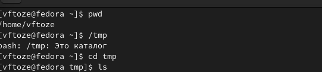

Определили, есть ли в каталоге /var/spool подкаталог с именем cron

Кажется, что пустой

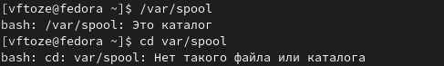

Перешли в наш домашний каталог и выводили на экран его содержимое и опредилили кто является владельцем 

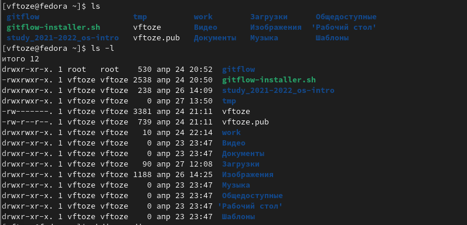

В домашнем каталоге создали новый каталог с именем newdir.

и В каталоге ~/newdir создали новый каталог с именем morefun.

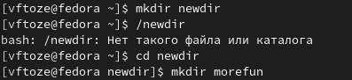	

В домашнем каталоге создали одной командой три новых каталога с именами

letters, memos, misk. Затем удалили эти каталоги одной командой.

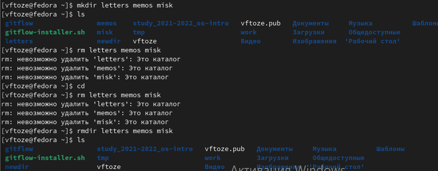

Пытались удалить ранее созданный каталог ~/newdir командой rm и Проверили

был ли каталог удалён и получается что нет

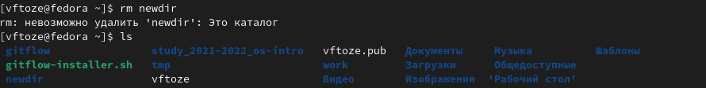

`	`Удалили каталог ~/newdir/morefun из домашнего каталога и Проверили, был ли каталог удалён.

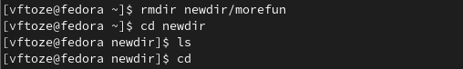

С помощью команды man определили, какую опцию команды ls нужно использовать для просмотра содержимое не только указанного каталога, но и подкаталогов, входящих в него.

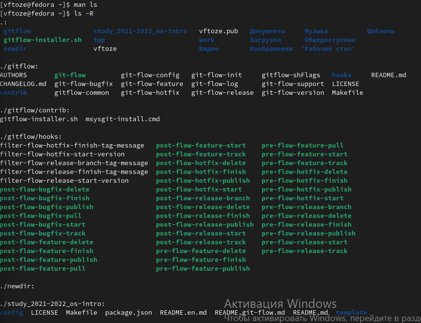

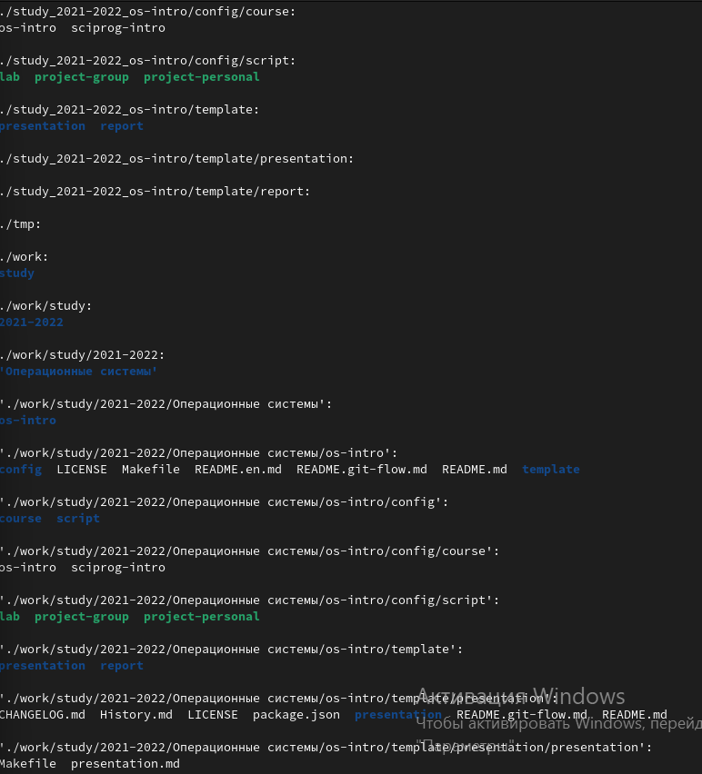

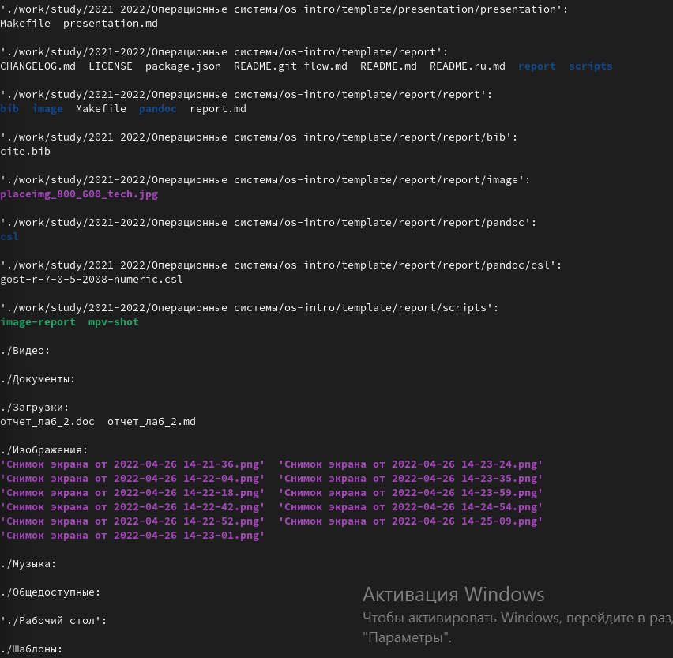

С помощью команды man определили набор опций команды ls, позволяющий отсортировать по времени последнего изменения выводимый список содержимого каталога с развёрнутым описанием файлов.

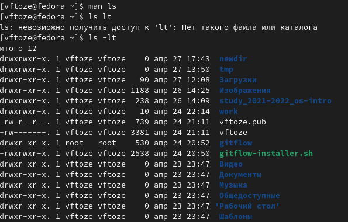

Использовали команду man для просмотра описания следующих команд: cd, pwd, mkdir, rmdir, rm. Пояснили основные опции этих команд.

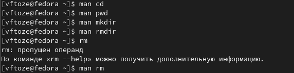

**Команда cd** используется для изменения текущего рабочего каталога

**pwd** команда, которая выводит полный путь от корневого каталога к текущему рабочему каталогу

**mkdir** команда для создания новых каталогов.

**rmdir** команда которая удаляет каталог из файловой системы

**Команда rm** служит для удаления указанных имен файлов из каталога

Использовали информацию, полученную при помощи команды history, выполнили модификацию и исполнение нескольких команд из буфера команд

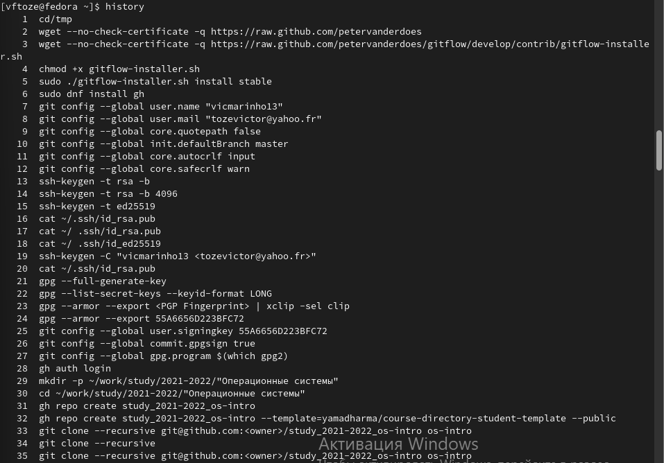

**Контрольные вопросы**

1. Что такое командная строка?

также называемый терминал, оболочка, или консолью, текстовый интерфейс для вашего компьютера. С помощью этой компьютерной программы вы можете интерпретировать команды и писать свои собственные сценарии

1. При помощи какой команды можно определить абсолютный путь текущего каталога?

он начинается от корня "/"

Приведите пример. /tmp

\3. При помощи какой команды и каких опций можно определить только тип файлов

и их имена в текущем каталоге? ls -a

1. Каким образом отобразить информацию о скрытых файлах? Приведите примеры.

\5. При помощи каких команд можно удалить файл и каталог? Можно ли это сделать

одной и той же командой? Приведите примеры.

Команды rm и rmdir 

Нет не можем

Пример rmdir newdir     rm lab1

\6. Каким образом можно вывести информацию о последних выполненных пользователем командах? работы? 

\7. Как воспользоваться историей команд для их модифицированного выполнения? Приведите примеры.

\8. Приведите примеры запуска нескольких команд в одной строке.

\9. Дайте определение и приведите примера символов экранирования.

\10. Охарактеризуйте вывод информации на экран после выполнения команды ls с опцией

l.

\11. Что такое относительный путь к файлу? Приведите примеры использования относительного и абсолютного пути при выполнении какой-либо команды.

\12. Как получить информацию об интересующей вас команде?

\13. Какая клавиша или комбинация клавиш служит для автоматического дополнения

вводимых команд
