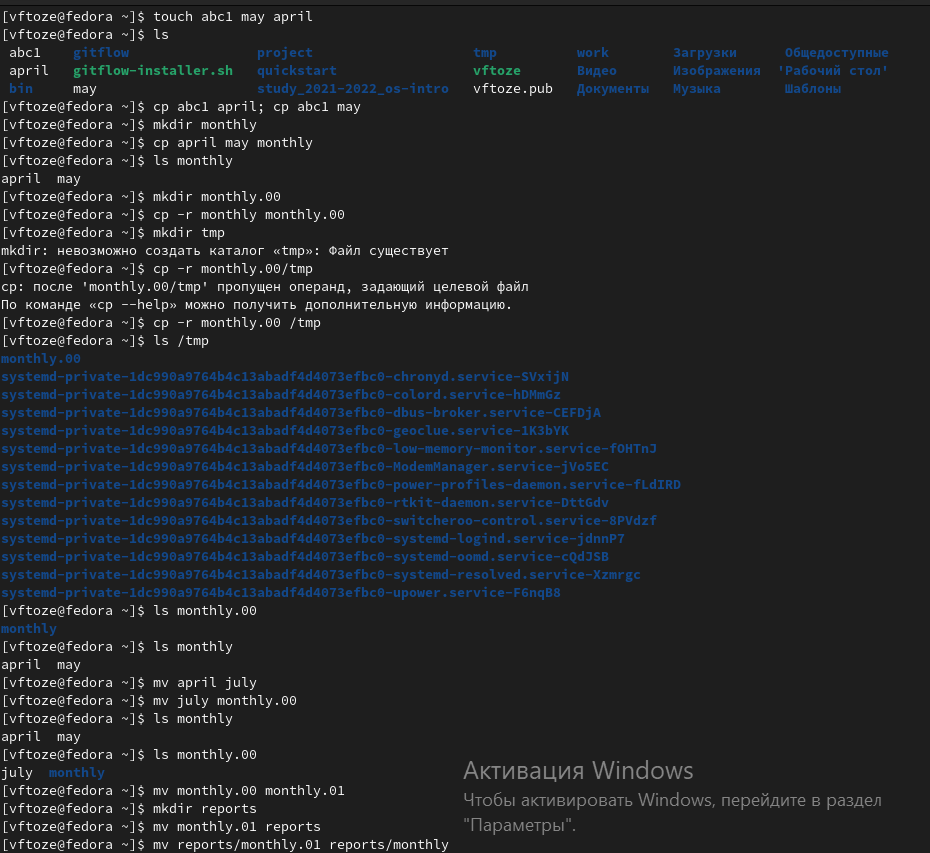
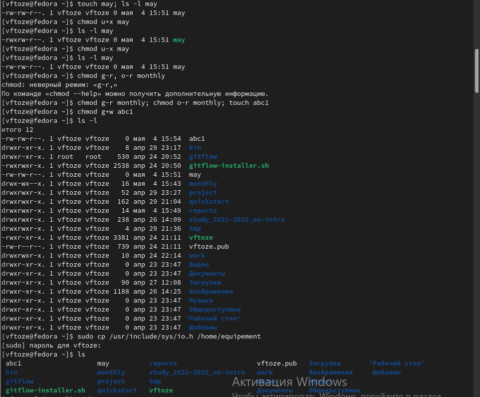
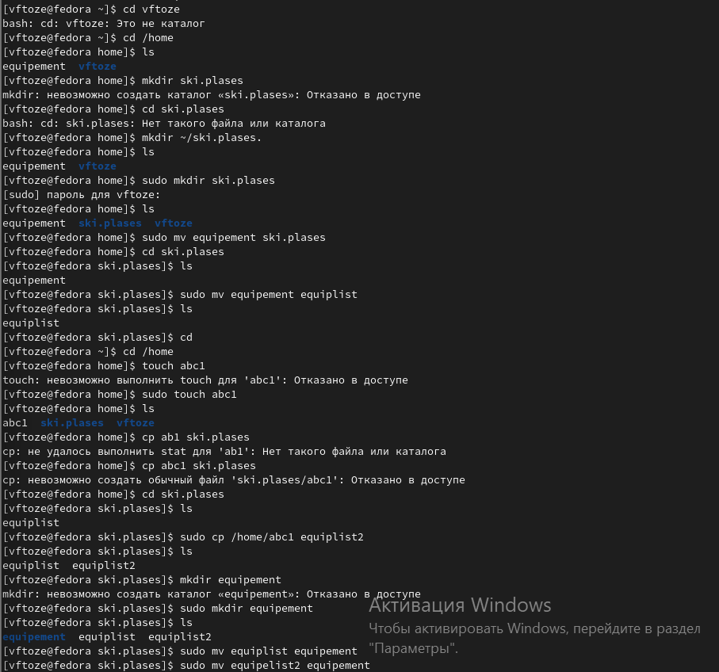
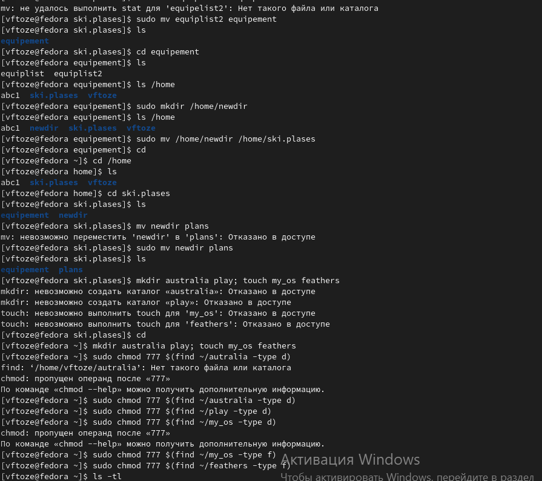
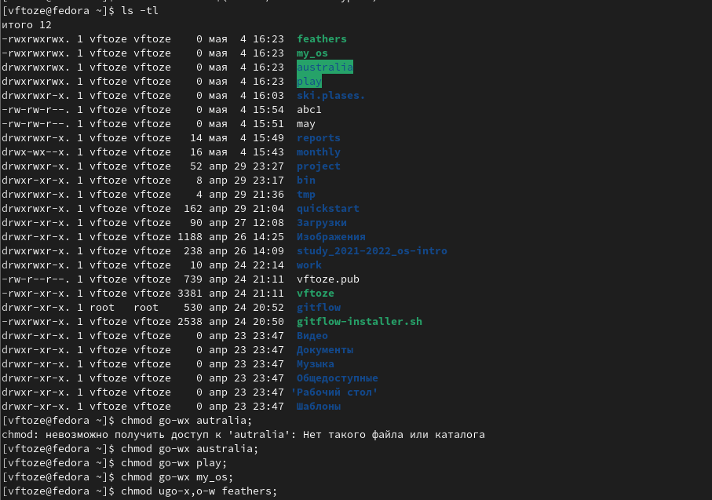
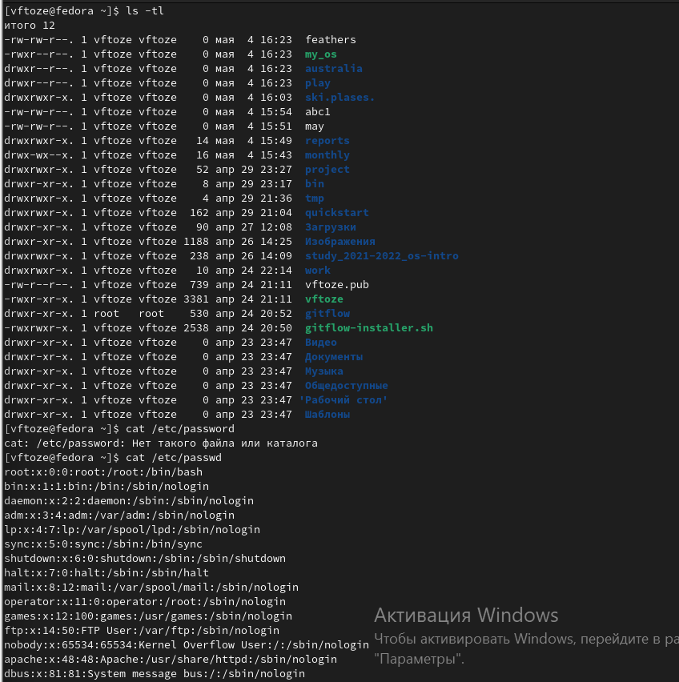
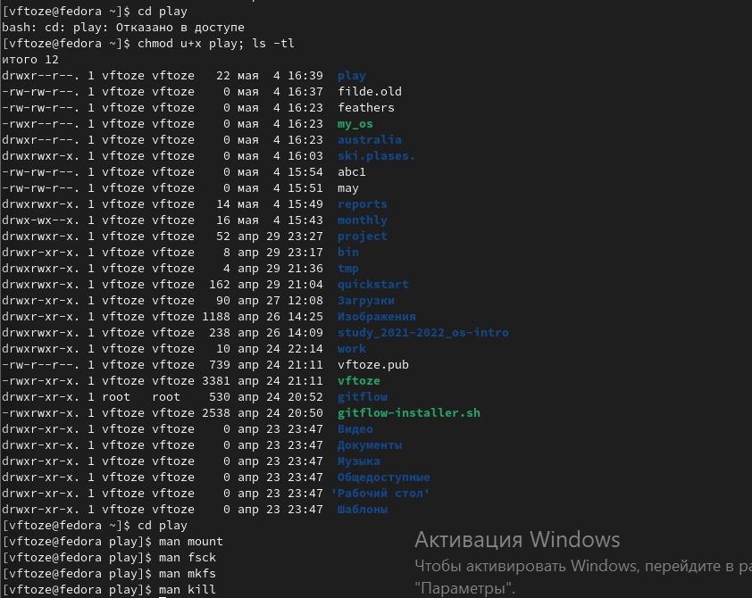

**РОССИЙСКИЙ УНИВЕРСИТЕТ ДРУЖБЫ НАРОДОВ**

**Факультет физико-математических и естественных наук**

**Кафедра прикладной информатики и теории вероятностей**

**ОТЧЕТ** 

**ПО ЛАБОРАТОРНОЙ РАБОТЕ № 5**	

*дисциплина:	Операционные системы* 	 

Студент:  Тозе Виктор Ф                                   

`	`Группа:НФИбд-02-21                                       

**МОСКВА**

2022	 г.

**Цель работы**

Ознакомление с файловой системой Linux, её структурой, именами и содержанием

каталогов. Приобретение практических навыков по применению команд для работы

с файлами и каталогами, по управлению процессами (и работами), по проверке использования диска и обслуживанию файловой системы.

**Ход работы**

Выполнили все примеры, приведённые в первой части описания лабораторной работы 

после этого Выполнили следующие действия ,используемые при этом команды и результаты их выполнения:

Скопировали файл /usr/include/sys/io.h в домашний каталог и назовили его

equipment.

. В домашнем каталоге создали директорию ~/ski.plases.

\- Переместили файл equipment в каталог ~/ski.plases.

\- Переименовали файл ~/ski.plases/equipment в ~/ski.plases/equiplist.

\- Создали в домашнем каталоге файл abc1 и скопируйте его в каталог

~/ski.plases, назовите его equiplist2.

\- Создали каталог с именем equipment в каталоге ~/ski.plases.

\- Переместили файлы ~/ski.plases/equiplist и equiplist2 в каталог

~/ski.plases/equipment.

Создали и переместили каталог ~/newdir в каталог ~/ski.plases и назовили

его plans.

Определили опции команды chmod, необходимые для того, чтобы присвоить перечисленным ниже файлам выделенные права доступа, считая, что в начале таких прав

нет:

3.1. drwxr--r-- ... australia

3.2. drwx--x--x ... play

3.3. -r-xr--r-- ... my\_os

3.4. -rw-rw-r-- ... feathers

При необходимости создали нужные файлы.

Затем проделали приведённые ниже упражнения

\- Просмотрели содержимое файла /etc/password.

-Скопировали файл ~/feathers в файл ~/file.old.

- Переместили файл ~/file.old в каталог ~/play.

\- Скопировали каталог ~/play в каталог ~/fun.

\- Переместили каталог ~/fun в каталог ~/play и назовите его games.

-Лишили владельца файла ~/feathers права на чтение.

Что произойдёт, если вы попытаетесь просмотреть файл ~/feathers командой

cat? Сообщения о том что отказано в доступе

` `Что произойдёт, если вы попытаетесь скопировать файл ~/feathers?

невозможно открыть для чтения, отказано в доступе

Дали владельцу файла ~/feathers право на чтение.

\- Лишите владельца каталога ~/play права на выполнение.

\- Перешли в каталог ~/play. Что произошло?

- Дали владельцу каталога ~/play право на выполнение.

\- Прочитали man по командам mount, fsck, mkfs, kill и кратко их охарактеризовали,

приведя примеры. 

**Вывод**

Мы ознакомились с файловой системой Linux, её структурой, именами и содержанием каталогов. Приобрели практические навыки по применению команд для работы с файлами и каталогами, по управлению процессами (и работами), по проверке использования диска и обслуживанию файловой системы.

Ответы на контрольные вопросы

\1. Дайте характеристику каждой файловой системе, существующей на жёстком диске компьютера, на котором вы выполняли лабораторную работу.

Ответ: С помощью команды df –T, мы можем познакомиться с файловыми системами · Файловая система devtmpfs была разработана для решения проблемы с доступностью устройств во время загрузки. Ядро создает файлы устройств по мере надобности, а также уведомляет менеджер udevd о том, что доступно новое устройство. После получения такого сигнала менеджер udevd не создает файлы устройств, а выполняет инициализацию устройства и отправляет уведомление процессу. Кроме того, он создает несколько символических ссылок в каталоге /dev для дальнейшей идентификации устройств. · Tmpfs — временное файловое хранилище в Unix . Предназначена для монтирования файловой системы, но размещается в ОЗУ вместо физического диска. Подобная конструкция является RAM диском.Все данные в Tmpfs являются временными, в том смысле, что ни одного файла не будет создано на жёстком диске. После перезагрузки все данные, содержащиеся в Tmpfs, будут утеряны. · Fourth extended file system , сокр. ext4, или ext4fs — журналируемая ФС, используемая в ОС с ядром Linux. Основана на ФС ext3, ранее использовавшейся по умолчанию во многих дистрибутивах GNU/Linux. · Распределенная сетевая файловая система AFS (Andrew File System) внедрена с целью создания единого файлового пространства пользователей при работе на различных фермах или рабочих станциях ОИЯИ, где домашний каталог пользователя определен как каталог в -AFS. Использование системы AFS позволяет пользователям осуществлять прямой доступ к файловому пространству других организаций, где эта система используется и где пользователь имеет регистрацию в AFS.

2.Приведите общую структуру файловой системы и дайте характеристику каждой директории первого уровня этой структуры.

Ответ: Все каталоги можно разделить на две группы: для статической (редко меняющейся) информации – /bin, /usr и динамической (часто меняющейся) информации – /var, /tmp. Исходя из этого администраторы могут разместить каждый из этих каталогов на собственном носителе, обладающем соответствующими характеристиками. · Корневой каталог. Корневой каталог / является основой любой ФС UNIX. Все остальные каталоги и файлы располагаются в рамках структуры (дерева), порождённой корневым каталогом, независимо от их физического местонахождения. · /bin. В этом каталоге находятся часто употребляемые команды и утилиты системы общего пользования. Сюда входят все базовые команды, доступные даже если была примонтирована только корневая файловая система. Примерами таких команд являются:Ls,cp и т.д. · /boot. Директория содержит всё необходимое для процесса загрузки операционной системы: программу-загрузчик, образ ядра операционной системы и т.п.. · /dev. Каталог содержит специальные файлы устройств, являющиеся интерфейсом доступа к периферийным устройствам. Наличие такого каталога не означает, что специальные файлы устройств нельзя создавать в другом месте, просто достаточно удобно иметь один каталог для всех файлов такого типа. · /etc. В этом каталоге находятся системные конфигурационные файлы. В качестве примеров можно привести файлы /etc/fstab, содержащий список монтируемых файловых систем, и /etc/ resolv.conf, который задаёт правила составления локальных DNS-запросов. Среди наиболее важных файлов – скрипты инифиализации и деинициализации системы. В системах, наследующих особенности UNIX System V, для них отведены каталоги с /etc/rc0.d по /etc/rc6.d и общий для всех файл описания – /etc/inittab. · /home (необязательно). Директория содержит домашние директории пользователей. Её существование в корневом каталоге не обязательно и её содержимое зависит от особенностей конкретной UNIX-подобной операционной системы. · /lib. Каталог для статических и динамических библиотек, необходимых для запуска программ, находящихся-в директориях/bin,/sbin. · /mnt. Стандартный каталог для временного монтирования файловых систем – например, гибких и флэш-дисков, компакт-дисков и т. п. · /root (необязательно). Директория содержит домашюю директорию суперпользователя. Её существование в корневом каталоге не обязательно. · /sbin. В этом каталоге находятся команды и утилиты для системного администратора. Примерами таких команд являются: route, halt, init и др. Для аналогичных целей применяются директории /usr/sbin и /usr/local/sbin. · /usr. Эта директория повторяет структуру корневой директории – содержит каталоги /usr/ bin, /usr/lib, /usr/sbin, служащие для аналогичных целей. Каталог /usr/include содержит заголовочные файлы языка C для всевозможные библиотек, расположенных в системе. · /usr/local является следующим уровнем повторения корневого каталога и служит для хранения программ, установленных администратором в дополнение к стандартной поставке операционной системы. · /usr/share хранит неизменяющиеся данные для установленных программ. Особый интерес представляет каталог /usr/share/doc, в который добавляется документация ко всем установленным программам. · /var, /tmp. Используются для хранения временных данных процессов – системных и пользовательских соответственно.

3.Какая операция должна быть выполнена,чтобы содержимое некоторой файловой системы было доступно операционной системе?

Ответ: С помощью команды cd мы переходим в каталог, в котором находится файл. С помощью less мы открываем этот файл.

4.Назовите основные причины нарушения целостности файловой системы. Какустранить повреждения файловой системы?

Ответ: Основные причины нарушения целостности файловой системы: · Из-за прерывания операций ввода-вывода выполняемых непосредственно с диском; · Сбоя питания; · Краха ОС; · Нарушения работы дискового КЭШа; Устранение поврежденных файлов:В большинстве случаев, проверка файловой системы способна обнаружить и выполнить ремонт такой ошибки автоматически, и после завершения процесс начальной загрузки продолжится как обычно. Если проблема файловой системы более серьезна, проверка файловой системы не может решить проблему автоматически. В этом случае процесс надо будет запустить вручную.

5.Как создаётся файловая система?

Ответ: Обычно при установке Linux создание файловых систем - компетенция инсталлятора, который осуществляет его с некоторыми опциями по умолчанию. Изменить характеристики, определенные для файловой системы при ее создании, невозможно без повторного выполнения этого процесса . Файловая система Ext2fs может быть создана любой из следующих команд - /sbin/mke2fs, / sbin/mkfs, /sbin/mkfs.ext2 с указанием файла устройства в качестве аргумента. Для создания XFS -mkfs.xfs (из пакета xfsprogs). Для создания файловой системы ext3fs -mke2fs с опцией j. Файловая система ReiserFS - /sbin/mkreiserfs из пакета reiserfsprogs.

\6. Дайте характеристику командам, которые позволяют просмотреть текстовые файлы.

Ответ: · Для просмотра небольших файлов -cat. (cat имя-файла) · Для просмотра больших файлов-less . (less имя-файла) · Для просмотра начала файла-head. По умолчанию она выводит первые 10 строк файла. (head [-n] имя-файла), n — количество выводимых строк. · Команда tail . выводит несколько (по умолчанию 10) последних строк файла. (tail [-n] имя-файла),n — количество выводимых строк.

\7. Приведите основные возможности команды cp в Linux

Ответ: При помощи команды cp осуществляется копирование файлов и каталогов (cp[-опции] исходный\_файл целевой\_файл) Возможности команды ср: · копирование файла в текущем каталоге · копирование нескольких файлов в каталог · копирование файлов в произвольном каталоге · опция i в команде cp поможет избежать уничтожения информации в случае, если на место целевого файла вы поставите имя уже существующего файла(т.е. система попросит подтвердить, что вы хотите перезаписать этот файл) · Команда cp с опцией r (recursive) позволяет копировать каталоги вместе с входящими в них файлами и каталогами.

\8. Назовите и дайте характеристику командам перемещения и переименованияфайлов и каталогов.

Ответ: Команды mv и mvdir предназначены для перемещения и переименования файлов и каталогов. (mv [-опции] старый\_файл новый\_файл) Для получения предупреждения перед переписыванием файла стоит использовать опцию i.

\9. Что такое права доступа? Как они могут быть изменены?

Ответ: Права доступа - совокупность правил, регламентирующих порядок и условия доступа субъекта к объектам информационной системы (информации, её носителям, процессам и другим ресурсам) установленных правовыми документами или собственником, владельцем информации. Для изменения прав доступа к файлу или каталогу используется команда-chmod.( chmod режим имя\_файла) Права доступа к файлу может поменять только владелец и администратор. Режим (в формате команды) имеет следующую структуру и способ записи: · = установить право · - лишить права · + дать право · r чтение · w запись · x выполнение · u (user) владелец файла · g (group) группа, к которой принадлежит владелец файла · (others) все остальные.

