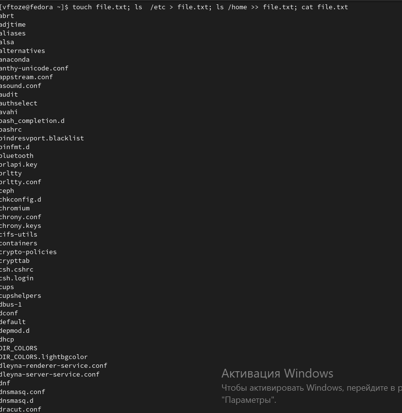
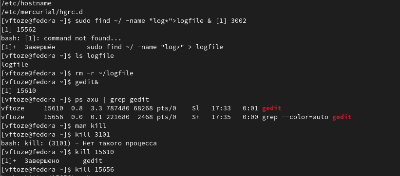
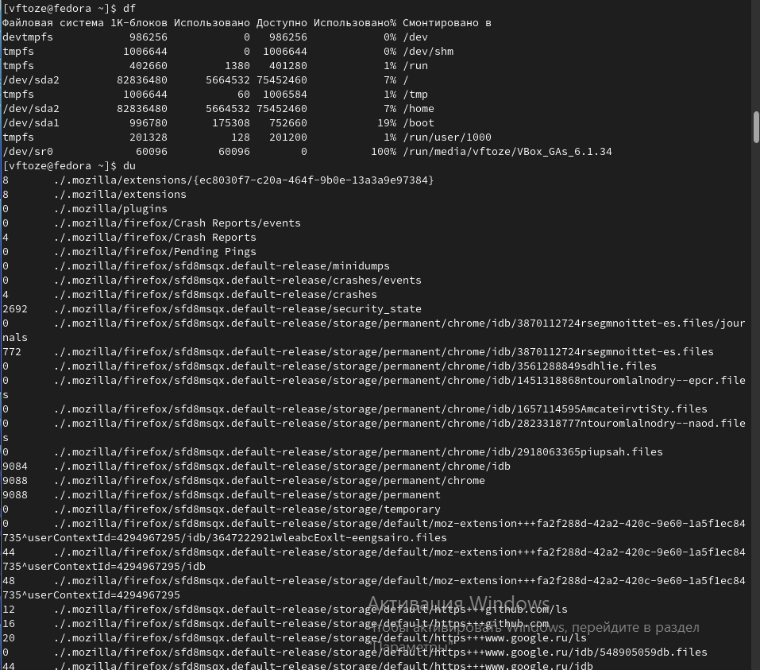
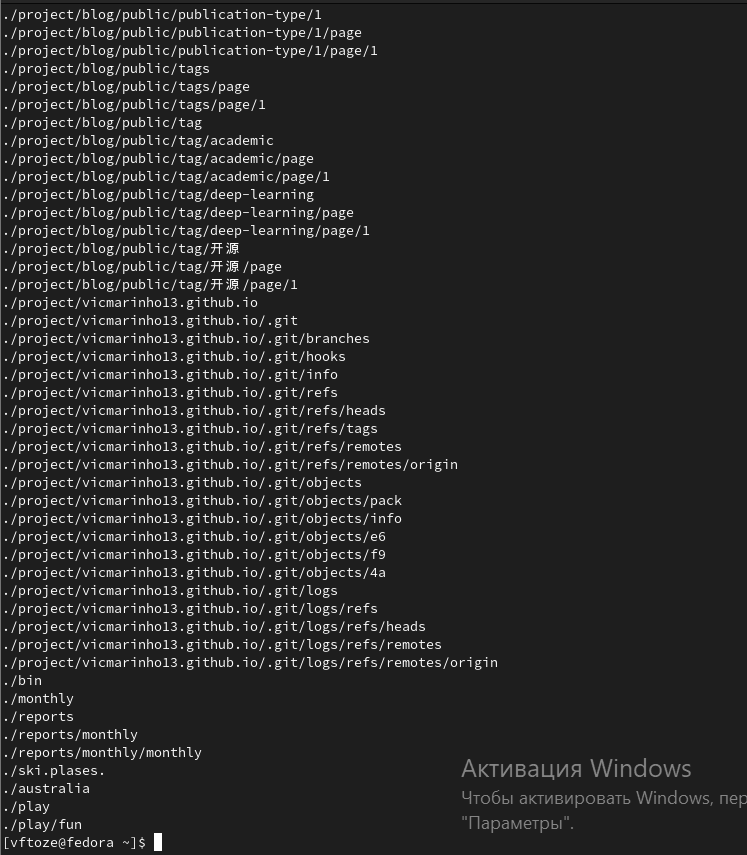

**РОССИЙСКИЙ УНИВЕРСИТЕТ ДРУЖБЫ НАРОДОВ**

**Факультет физико-математических и естественных наук**

**Кафедра прикладной информатики и теории вероятностей**

**ОТЧЕТ** 

**ПО ЛАБОРАТОРНОЙ РАБОТЕ № 6**	

*дисциплина:	Операционные системы* 	 

Студент: Тозе Виктор Ф                                    

`	`Группа: НФИбд-02-21                                       

**МОСКВА**

2022	 г.

**Цель работы**

Ознакомление с инструментами поиска файлов и фильтрации текстовых данных.

Приобретение практических навыков: по управлению процессами (и заданиями), по

проверке использования диска и обслуживанию файловых систем

**Ход работы**

Осуществили вход в систему, используя соответствующее имя пользователя.

Записали в файл file.txt названия файлов, содержащихся в каталоге /etc. Дописали в этот же файл названия файлов, содержащихся в вашем домашнем каталог

Выведили имена всех файлов из file.txt, имеющих расширение .conf, после чего

записали их в новый текстовой файл conf.txt. и Определили, какие файлы в нашем домашнем каталоге имеют имена, начинавшиеся

с символа c

Выведили на экран (по странично) имена файлов из каталога /etc, начинающиеся

с символа h

![]2.png "3")

. Запустили в фоновом режиме процесс, который будет записывать в файл ~/logfile файлы, имена которых начинаются с log. Удалили файл ~/logfile. Запустили из консоли в фоновом режиме редактор gedit. Определили идентификатор процесса gedit, используя команду ps, конвейер и фильтр grep Прочтели справку (man) команды kill, после чего использовали её для завершения процесса gedit.

Выполнили команды df и du, предварительно получив более подробную информацию

об этих командах, с помощью команды man.

Воспользовавшись справкой команды find, выведили имена всех директорий, имеющихся в ваш

Вывод

Я ознакомилась с инструментами поиска файлов и фильтрации текстовых данных. А также приобрела практические навыки: по управлению процессами (и заданиями), по проверке использования диска и обслуживанию файловых систем.

**Ответы на контрольные вопросы**

\1. Какие потоки ввода вывода вы знаете

Ответ: 1. – stdin — стандартный поток ввода (клавиатура),

– stdout — стандартный поток вывода (консоль),

– stderr — стандартный поток вывод сообщений об ошибках на экран

\2. Объясните разницу между операцией > и >>.

Ответ: Символ < используется для переназначения стандартного ввода команды. Символ >> используется для присоединения данных в конец файла стандартного вывода команды(файл открывается в режиме добавления)

\3. Что такое конвейер?

Ответ: Конвейер - способ связи между двумя программами.Конвейер (pipe) служит для объединения простых команд или утилит в цепочки, в которых результат работы предыдущей команды передается последующей. Синтаксис следующий: команда1 | команда 2

\4. Что такое PID и GID?

Ответ: Process ID(PID) - идентификатор порожденного процесса. Group ID (GID-идентификация группы пользователей.

\5. Что такое процесс? Чем это понятие отличается от программы??

Ответ: Процесс - это программа, которая выполняется в отдельном виртуальном адресном пространстве. Когда пользователь регистрируется в системе, автоматически создается процесс, в котором выполняется оболочка (shell), например, /bin/bash. Компьютерная программа сама по себе — это только пассивная совокупность инструкций, в то время как процесс — это непосредственное выполнение этих инструкций.

\6. Что такое задачи и какая команда позволяет ими управлять?

Ответ: Запущенные фоном программы называются задачами (jobs). Ими можно управлять с помощью команды jobs, которая выводит список запущенных в данный момент задач. Для завершения задачи необходимо выполнить команду : kill %номер задачи

