**РОССИЙСКИЙ УНИВЕРСИТЕТ ДРУЖБЫ НАРОДОВ**

**Факультет физико-математических и естественных наук**

**Кафедра прикладной информатики и теории вероятностей**

**ОТЧЕТ** 

**ПО ЛАБОРАТОРНОЙ РАБОТЕ № 7**	

*дисциплина:	Операционные системы*	 

Студент: Тозе Виктор Ф                                  

`	`Группа: НФИбд-02-21                                       

**МОСКВА**

2022	 г.

**Цель работы**

Освоение основных возможностей командной оболочки Midnight Commander. Приобретение навыков практической работы по просмотру каталогов и файлов; манипуляций с ними.

**Ход работы**

**1-Задание по mc**

Изучили информацию о mc, вызвав в командной строке man mc и

Запустите из командной строки mc, изучили его структуру и меню.

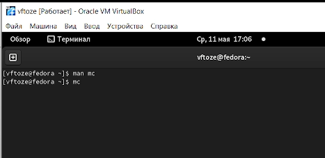

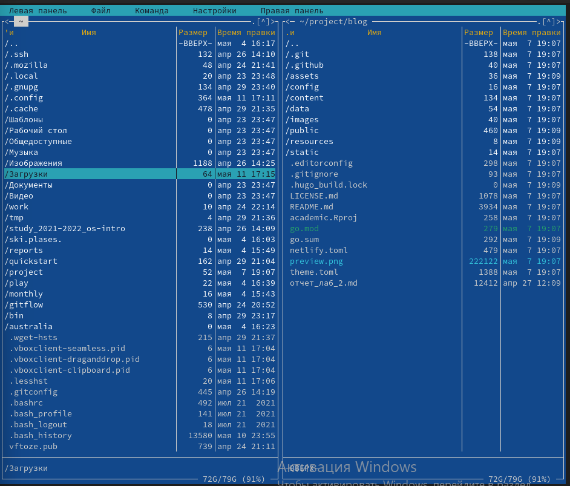

Выполнили несколько операций в mc, используя управляющие клавиши (операции

с панелями; выделение/отмена выделения файлов, копирование/перемещение файлов, получение информации о размере и правах доступа на файлы и/или каталоги

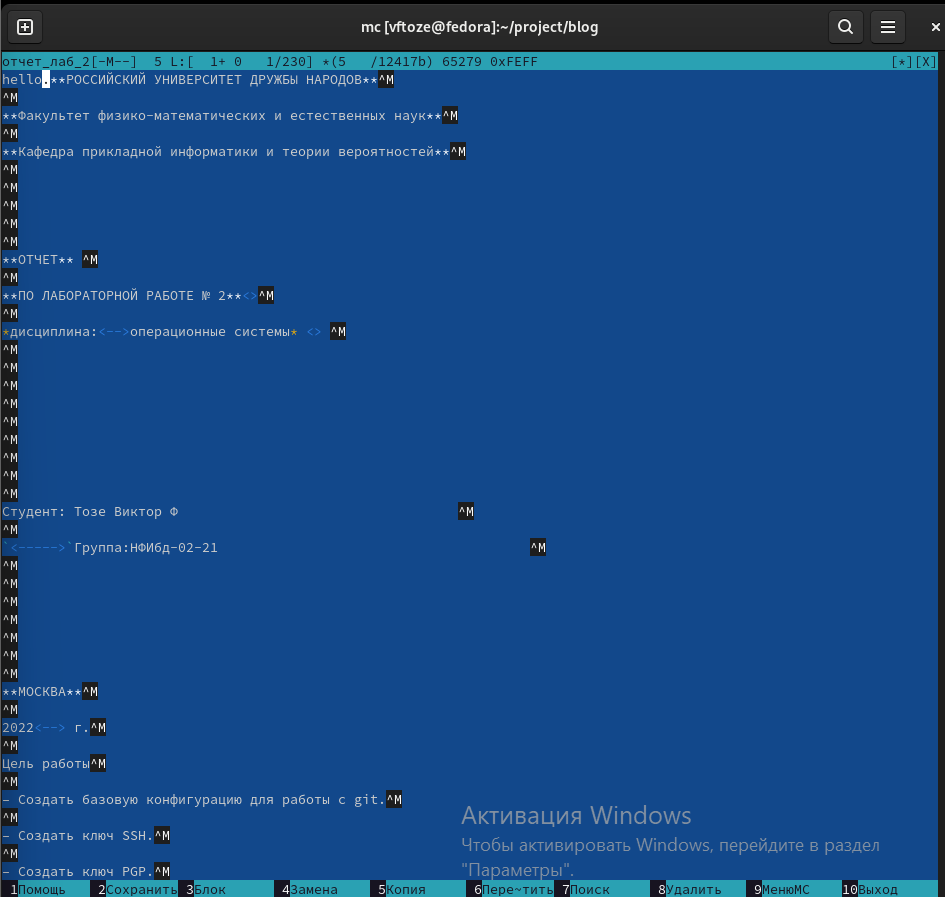и т.п.)

Выполнили основные команды меню левой (или правой) панели и Оценили степень

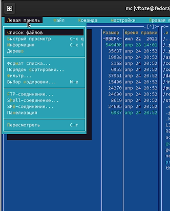подробности вывода информации о файлах	

Используя возможности подменю Файл , выполнили:

– просмотр содержимого текстового файла;

– редактирование содержимого текстового файла (без сохранения результатов

редактирования);

– создание каталога;

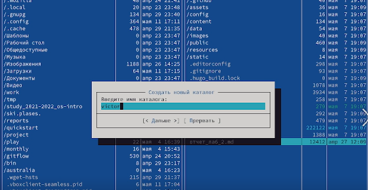

– копирование в файлов в созданный каталог

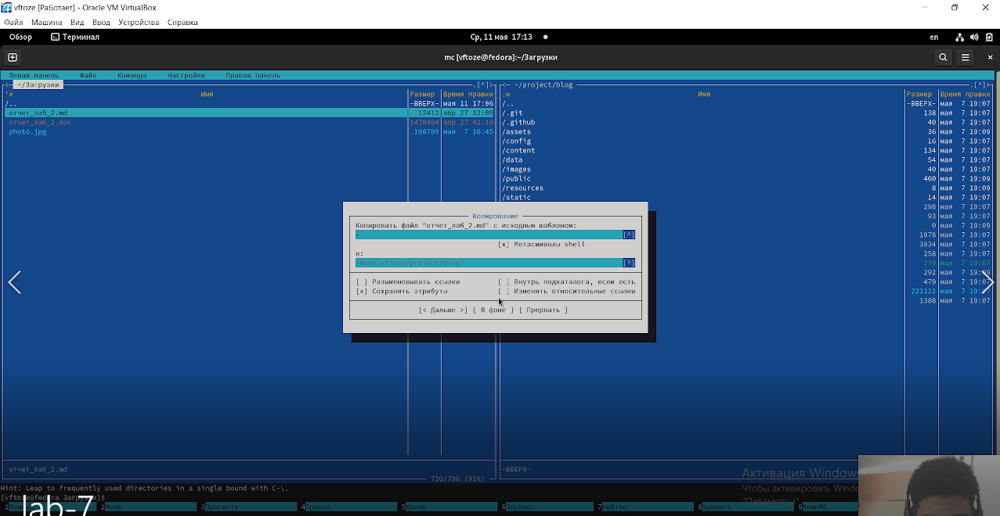

С помощью соответствующих средств подменю Команда осуществили:

– поиск в файловой системе файла с заданными условиями (например, файла

с расширением .c или .cpp, содержащего строку main);

– выбор и повторение одной из предыдущих команд;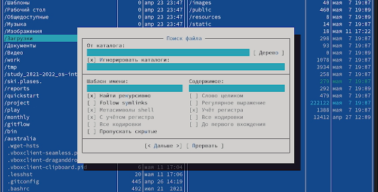

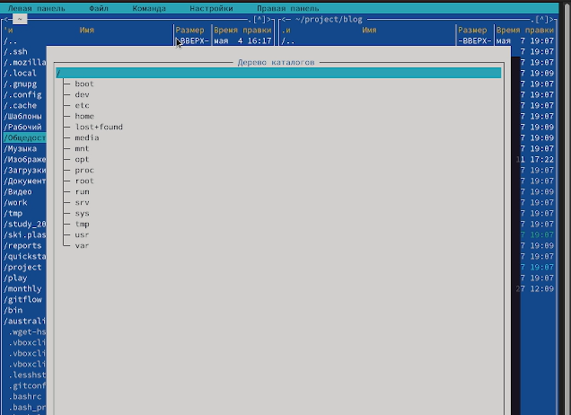– переход в домашний каталог;

анализ файла меню и файла расширений

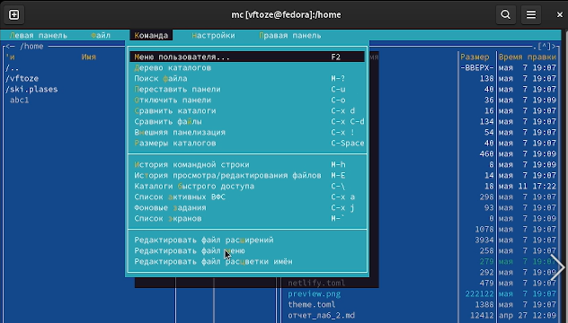

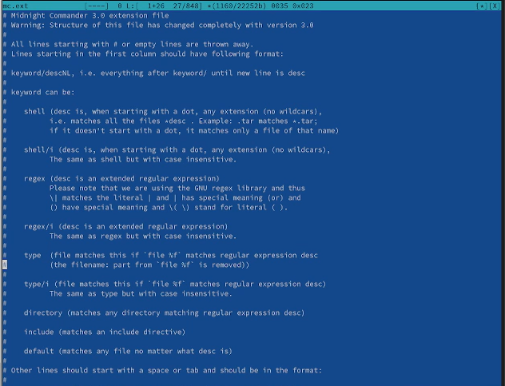

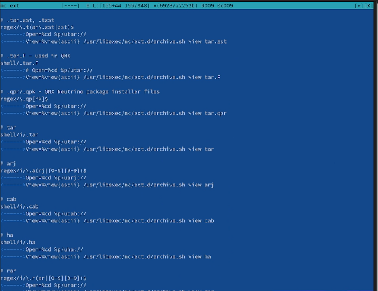

Вызовили подменю Настройки . Освоили операции, определяющие структуру экрана mc

(Full screen, Double Width, Show Hidden Files и т.д.)ю

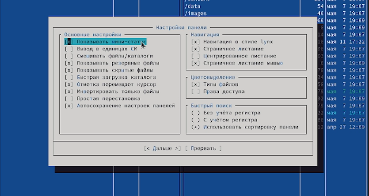

2- **Задание по встроенному редактору mc**

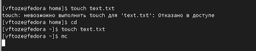Создали текстовой файл text.txt и Открыли этот файл с помощью встроенного в mc редактора

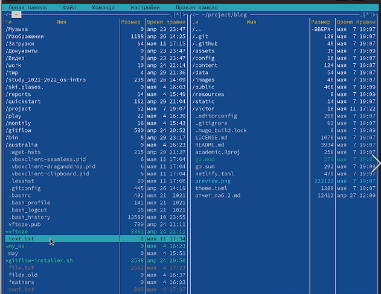

Вставили в открытый файл небольшой фрагмент текста, скопированный из любого

другого файла или Интернета

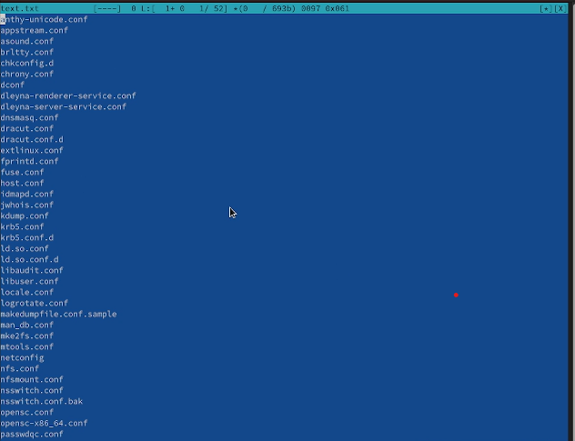

Проделали с текстом следующие манипуляции, используя горячие клавиши:

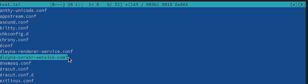- Удалилт строку текста.

Выделили фрагмент текста и скопировали его на новую строку и Сохранили файл.

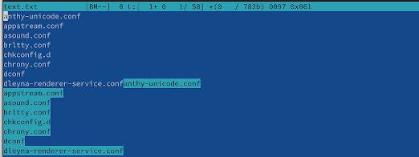

Открыли файл с исходным текстом на некотором языке программирования (например C или J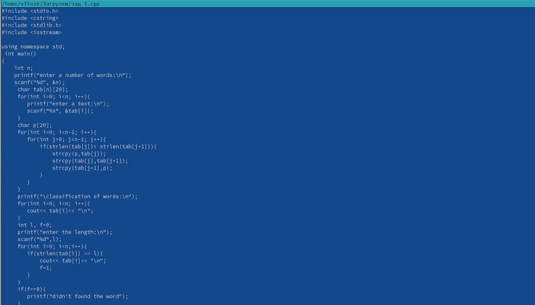ava)

Используя меню редактора, включиkb подсветку синтаксиса, если она не включена,

или выключиkb, если она включена.

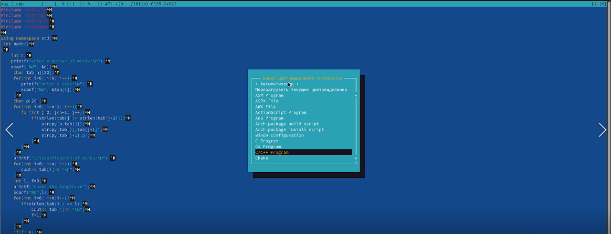

**вывод**

мы освоили основные возможности командной оболочки Midnight Commander (mc), приобрели навыки практической работы по просмотру каталогов и файлов

**Ответы на контрольные вопросы**

\1) mc - визуальная файловая оболочка для UNIX/Linux систем, аналог Far, Norton Commander, но оболочки в Linux несравненно богаче. На языке командной оболочки можно писать небольшие программы для выполнения ряда последовательных операций с файлами и содержащимися в них данными. Команда Переставить панели (Ctrl+U)меняет местами содержимое правой и левой панелей.Команде Отключить панели(Ctrl+O). По команде Сравнить каталоги (Ctrl-X,D) сравнивается содержимое каталогов, отображаемых на левой и правой панелях. Помимо того, что может задаваться формат вывода на панель списка файлов, любую панель можно перевести в один из следующих режимов Режим "Информация". В этом режиме на панель выводится информация оподсвеченном в другой панели файле и о текущей файловой системе. Режим "Дерево".В режиме отображения дерева каталогов в одной из панелей выводится графическоеизображение структуры дерева каталогов. Этот режим подобен тому, который выувидите, выбрав команду Дерево каталогов из меню Команды, только в последнемслучае изображение структуры каталогов выводится в отдельное окно. Левая Панель и Правая Панель меню (левой/правой панели) позволяют оперировать режимами отображения панелей. Меню Левая Панель и Правая Панель позволяют оперироватьпанелями. Формат списка бывает: · Стандартный – вывод списка файлов и каталогов поумолчанию; · Ускоренный – имена файла или каталогов; · Расширенный – атрибуты,владелец, группа и размер; · Определённый пользователем – имя, размер и атрибуты;Быстрый просмотр – выполняет быстрый просмотр содержимого панели. Информация– выдает всю имеющуюся информацию о файле или каталоге. Порядок сортировки –бывает: без сортировки, по имени, расширенный, время правки, время правки, времядоступа, время изменение атрибута, размер, узел.

\2) Командные интерпретатор Shell и оболочка Midnight Commander имеют похожуюструктуру и многие одинаковые команды можно выполнить в обоих оболочках: · Системная информация · Поиск · Копирование

\3) Меню левой панели Подпункты меню: · Список файлов показывает файлы вдомашнем каталоге. · Быстрый просмотр позволяет выполнить быстрый просмотрсодержимого панели. · Информация позволяет посмотреть информацию о файле иликаталоге · Командная оболочка Midnight Commander В меню каждой (левой илиправой) панели можно выбрать Формат списка: стандартный, ускоренный,расширенный и определённый пользователем. · Порядок сортировки позволяет задатькритерии сортировки при выводе списка файлов и каталогов: без сортировки, поимени, расширенный, время правки, время доступа, время изменения атрибута, размер, узел.

\4) Меню файл Подпункты меню: · Просмотр ( F3 ) позволяет посмотреть содержимоетекущего файла без возможности редактирования. · Просмотр вывода команды ( М + ! )функция запроса команды с параметрами. · Правка ( F4 ) открывает текущий (иливыделенный) файл для его редактирования. · Копирование ( F5 ) осуществляеткопирование одного или нескольких файлов или каталогов в указанное пользователемво всплывающем окне место. · Права доступа ( Ctrl-x c ) позволяет изменить правадоступа к одному или нескольким файлам или каталогам. · Права доступа на файлы икаталоги · Жёсткая ссылка ( Ctrl-x l ) позволяет создать жёсткую ссылку к текущему(или выделенному) файлу1 . · Символическая ссылка ( Ctrl-x s ) — позволяет создатьсимволическую ссылку к текущему файлу . · Владелец группы ( Ctrl-x o ) позволяетзадать владельца и имя группы для одного или нескольких файлов или каталогов. ·Права (расширенные) позволяет изменить права доступа и владения для одного илинескольких файлов или каталогов. · Переименование ( F6 ) позволяет переименоватьодин или несколько файлов или каталогов. · Создание каталога ( F7 ) позволяет создатькаталог. · Удалить ( F8 ) позволяет удалить один или несколько файлов или каталогов. ·Выход ( F10 ) завершает работу mc.

\5) Меню команда Подпункты меню: · Дерево каталогов отображает структуру каталоговсистемы. · Поиск файла выполняет поиск файлов по заданным параметрам. ·Переставить панели меняет местами левую и правую панели. · Сравнить каталоги (Ctrl-x d ) сравнивает содержимое двух каталогов. · Размеры каталогов отображаетразмер и время изменения каталога (по умол- чанию в mc размер каталога корректно неотображается). · История командной строки выводит на экран список ранеевыполненных в оболочке команд. · Каталоги быстрого доступа ( Ctrl-\ ) при вызовевыполняется быстрая смена текущего · каталога на один из заданного списка. ·Восстановление файлов позволяет восстановить файлы на файловых систе- мах ext2 иext3. · Редактировать файл расширений позволяет задать с помощью определённогосинтаксиса действия при запуске файлов с определённым расширением (напри- мер,какое программного обеспечение запускать для открытия или редактирова- ния файловс расширением .c или .cpp). ·

Редактировать файл меню позволяет отредактировать контекстное меню поль- зователя,вызываемое по клавише F2 . · Редактировать файл расцветки имён позволяет подобратьоптимальную для пользователя расцветку имён файлов в зависимости от их типа.

\6) Меню настройки Подпункты меню: · Конфигурация позволяет скорректироватьнастройки работы с панелями. · Внешний вид и Настройки панелей определяетэлементы, отображаемые при вызове mc, а также цветовое выделение. · Биты символовзадаёт формат обработки информации локальным термина- лом. · Подтверждениепозволяет установить или убрать вывод окна с запросом подтверждения действий приоперациях удаления и перезаписи файлов, а также при выходе из программы. ·Распознание клавиш диалоговое окно используется для тестирования функциональныхклавиш, клавиш управления курсором и прочее. · Виртуальные ФС настройкивиртуальной файловой системы: тайм-аут, пароль и прочее.

\7) Встроенные команды mc: · F1 Вызов контекстно-зависимой подсказки. · F2 Вызовпользовательского меню с возможностью создания and/or. · F3 Просмотр содержимогофайла, на который указывает подсветка в активной панели. · F4 Вызов встроенного вmc редактора для изменения содержания файла, на который · указывает подсветка вактивной панели. · F5 Копирование одного или нескольких файлов, отмеченных впервой (активной) панели, в каталог, отображаемый на второй панели. · F6 Перенос одного или нескольких файлов, отмеченных в первой панели, в каталог, отображаемый на второй панели. · F7 Создание подкаталога в каталоге, отображаемом в активной панели. · F8 Удаление одного или нескольких файлов, отмеченных в первой панелифайлов. · Вызов меню mc. · F10 Выход из mc.

\8) Команды mc : · Ctrl+y удалить строку. · Ctrl+u отмена последней операции. · Insвставка/замена. · F7 поиск. · Shift+F7 повтор последней операции поиска. · F4замена файла. · F3 первое нажатие начало выделения, второе это окончаниевыделения. · F5 копировать выделенный фрагмент F6 переместить выделенныйфрагмент. · F8 удалить выделенный фрагмент. · F2 записать изменения в файл. ·F10 выйти из редактора.

\9) Один из четырех форматов списка в Midnight Commander –пользовательский,определённый самим пользователем позволяет ему редактировать меню любого издвух списков. А меню пользователя – это меню, состоящее из команд, определенныхпользователем. При вызове меню используется файл ~/.mc.menu. Если такого файланет, то по умолчанию используется системный файл меню /usr/lib/mc/mc.menu. Всестроки в этих файлах , начинающиеся с пробела или табуляции, являются командами,которые выполняются при выборе записи.

\10) Когда мы выделяем файл не являющегося исполняемым, Midnight Commanderсравнивает расширение выбранного файла с расширениями, прописанными в«файле расширений» ~/ mc.ext. Если в файле расширений найдется подраздел,задающий процедуры обработки файлов с данным расширением, то обработкафайла производится в соответствии с заданными в этом подразделе командами ифайлами: · файл помощи для MC.

/usr/lib/mc.hlp · файл расширений, используемый по умолчанию. /usr/lib/mc/mc.ext ·файл расширений, конфигурации редактора. $HOME/.mc.ext · системныйинициализационный файл. /usr/lib/mc/mc.ini · фаил который содержит основныеустановки. /usr/lib/mc/mc.lib · инициализационный файл пользователя. Если онсуществует, то системный файл mc.ini игнорируется. $HOME/.mc.ini · этот файлсодержит подсказки, отображаемые в нижней части экрана. /usr/lib/mc/mc.hint ·системный файл меню MC, используемый по умолчанию. /usr/lib/mc/mc.menu · файлменю пользователя. Если он существует, то системный файл меню игнорируется.$HOME/.mc.menu · инициализационный файл пользователя. Если он существует, тосистемный файл mc.ini игнорируется. $HOME/.mc.tree

