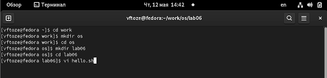
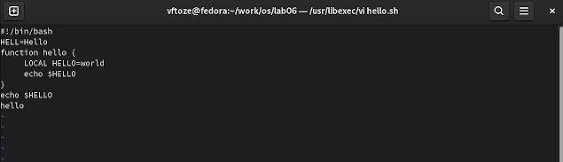
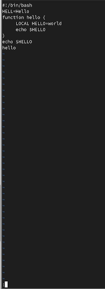
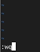
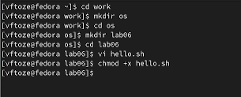
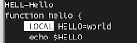
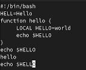
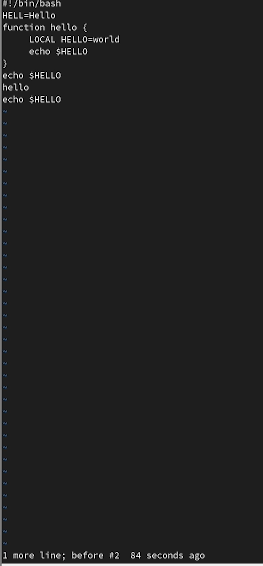
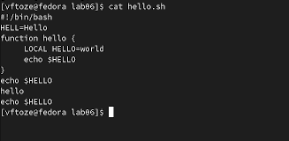

**РОССИЙСКИЙ УНИВЕРСИТЕТ ДРУЖБЫ НАРОДОВ**

**Факультет физико-математических и естественных наук**

**Кафедра прикладной информатики и теории вероятностей**

**ОТЧЕТ** 

**ПО ЛАБОРАТОРНОЙ РАБОТЕ № 8**

*дисциплина:	Операционные системы*	 

Студент:   Тозе Виктор Ф                                  

`	`Группа: НФИбд-02-21                                      

**МОСКВА**

2022	 г.

**Цель работы:**

Познакомиться с операционной системой Linux. Получить практические навыки работы с редактором vi, установленным по умолчанию практ

**Ход работы**

**Задание 1. Создание нового файла с использованием vi**

Создали каталог с именем ~/work/os/lab06.

` `Перешли во вновь созданный каталог.

` `Вызвали vi и создайте файл hello.sh

Нажали клавишу i и вводите следующий текст.

` `#!/bin/bash

` `HELL=Hello

` `function hello {

` `LOCAL HELLO=World

` `echo $HELLO

` `}

` `echo $HELLO

` `hello

Нажали клавишу Esc для перехода в командный режим после завершения ввода

Текста

Нажали : для перехода в режим последней строки и внизу вашего экрана появится

приглашение в виде двоеточия.

` `Нажимали w (записать) и q (выйти), а затем нажали клавишу Enter для сохранения

вашего текста и завершения работы.

Сделайте файл исполняемым

chmod +x hello.sh

**Задание 2. Редактирование существующего файла**

Вызвали vi на редактирование файла

` `vi ~/work/os/lab06/hello.sh

Установили курсор в конец слова HELL второй строки.

и Перешли в режим вставки и замените на HELLO. Нажали Esc для возврата в командный режим.

	

Установите курсор на четвертую строку и сотрили слово LOCAL

.Перешли в режим вставки и наберите следующий текст: local, нажали Esc для

возврата в командный режим.

\6. Установили курсор на последней строке файла. Вставили после неё строку, содержащую

следующий текст: echo $HELLO

Удалили последнюю строку.

 Введили команду отмены изменений u для отмены последней команды.

Введили символ : для перехода в режим последней строки. Записали произведённые

изменения и вышли из vi

**Заключение**

Мы познакомились с операционной системой LINUX. Получили практические навыки работы с редактором vi, установленным по умолчанию  практически во всех дистрибутивах

**Ответы на контрольные вопросы**

\1. Командный режим позволяет управлять курсором и вводить командыредактирования. Режим вставки допускает производить ввод текста. При этомтекст не будет восприниматься, как команды редактирования. Режим последнейстроки позволяет производить запись файла на диск и выходить из редактора Vi.Кроме того, используя этот режим, можно вводить дополнительные командыредактирования.

\2. Если необходимо просто выйти Vi (без сохранения выполненных изменений), тонеобходимо в последней строке набрать символ q (или q!).

\3. 0 (ноль) - перейти в начало строки; $ - перейти в конец строки; G - перейти в конецфайла; nG - перейти на строку номер n.

\4. Редактор vi предполагает, что слово - это строка символов, которая может включать всебя буквы, цифры и символы подчеркивания.

\5. 0 (ноль) - перейти в начало строки; $ - перейти в конец строки; 6. Добавление /вставка текста а- добавить текст после курсора; А- добавить текст в конец строки; i- вставить текст перед курсором; ni- вставить текст n раз; I- вставить текст в началостроки. Вставка строки o-вставить строку под курсором; О- вставить строкунад курсором. Удаление текста x- удалить один символ в буфер; dw- удалить однослово в буфер; d$- удалить в

буфер текст от курсора до конца строки; d0-(ноль) - удалить в буфер текст от начала строки до позиции курсора; dd- удалить в буфер одну строку; 10dd- удалить вбуфер 10 строк. Отмена и повтор произведенных изменений u- отменить последнееизменение; - повторить последнее изменение. Копирование текста в буфер Y- скопировать строку в буфер; nY- скопировать n строк в буфер; yw- скопировать слово в буфер; Вставка текста из буфера p- вставить текст из буфера после курсора; P- вставить текст из буфера перед курсором. Замена текста cw - заменить слово; n cw - заменить n слов; c$- заменить текст от курсора до конца строки; r- заменить слово; R- заменить текст. Поиск текста / <текст> - произвести поиск вперед потексту указанной строки символов <текст>; ? <текст> - произвести поиск назад потексту указанной строки символов <текст>.

\6. c$ - заменить текст от курсора до конца строки.

\7. u- отменить последнее изменение

\8. Kопирование и перемещение текста :n,m d-уничтожить строки с n по m пример:: 3,8d : i,j m k- переместить строки с i по j , начиная со строки k пример : :4,9m12 : i,j t k- копировать строки с i по j на строку k пример: : 2,5 t 13 : i,j w<имяфайла>- записать строки с i по j в файл с именем

<имяфайла> пример: : 5,9 <имя файла>. Запись в файл и выход из редактора :w- записать измененныйтекст в файл на диске, не выходя из Vi; :w - записатьизмененный текст в новый файл с именем ; :w! <имяфайла>- записать измененныйтекст в файл с именем<имя\_файла> ; - :wq- записать изменения в файл и выйти из Vi; :q- выйти из редактора Vi; :q!- выйти из редактора без записи; :e!- вернуться в командный режим, отменив все изменения,произведенные со времени последней записи

\9. $ - перемещает курсор в конец строки.

\10. Опции редактора Vi позволяют настроить рабочую среду. Для задания опцийиспользуется команда set (в режиме последней строки): : set all - вывести полныйсписок опций; : set nu - вывести номера строк; : set list - вывести невидимыесимволы; : set ic - не учитывать при поиске, является ли символ прописным илистрочным.

\11. Нажатие клавиши ESC всегда переводит Vi в командный режим (это удобно, когдавы точно не помните в каком режиме находитесь). Если вы нажмете клавишуESC, находясь в командном режиме, машина напомнит вам об этом, подавзвуковой сигнал.

\12. Командный –>вставки– >последняя строка (командная строка).
