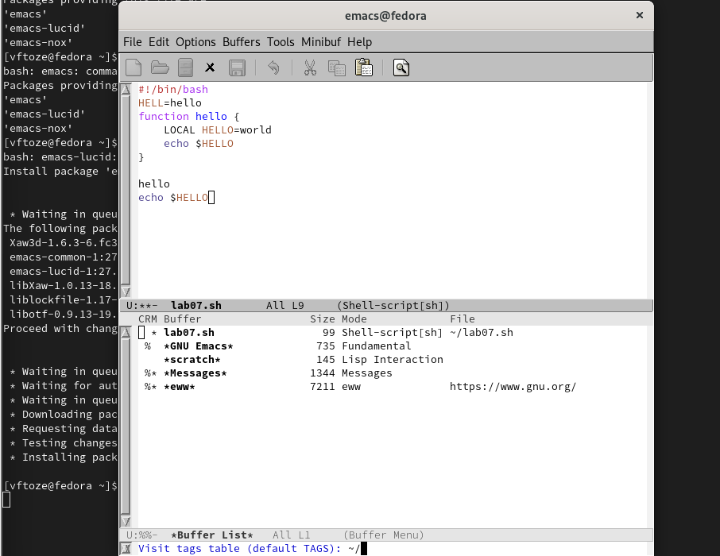

**РОССИЙСКИЙ УНИВЕРСИТЕТ ДРУЖБЫ НАРОДОВ**

**Факультет физико-математических и естественных наук**

**Кафедра прикладной информатики и теории вероятностей**

**ОТЧЕТ** 

**ПО ЛАБОРАТОРНОЙ РАБОТЕ № 	9**

*дисциплина:	Операционные системы* 

Студент:  Тозе Виктор ф                                    

`	`Группа: НФИбд-02-21                                      

**МОСКВА**

2022	 г.

**Цель работы:** 

Познакомиться с операционной системой Linux. Получить практические навыки работы с редактором Emacs.

**Ход работы:**

Открыли emacs и создали файл lab07.sh с помощью комбинации Ctrl-x Ctrl-f (C-x C-f).

и наберили текст:**

#!/bin/bash

HELL=Hello

function hello {

LOCAL HELLO=World

` `echo $HELLO

` `}

затем сохранили файл с помощью комбинации Ctrl-x Ctrl-s (C-x C-s)

Вырезали одной командой целую строку (С-k) echo $HELLO и Вставили эту строку в конец файла (C-y).

Выдели область текста (C-space) Скопировали область в буфер обмена (M-w).

Вставили область в конец файла

Отменили последнее действие (C-/).

Переместили курсор в начало строки (C-a).

Переместили курсор в конец строки (C-e).

Переместили курсор в начало буфера (M-<).

Переместили курсор в конец буфера (M->).

Ввели список активных буферов на экран (C-x C-b)

Переместили во вновь открытое окно (C-x) o со списком открытых буферов

и переключили на другой буфер.

Закроли это окно (C-x 0)

Поделили фрейм на 4 части: разделили фрейм на два окна по вертикали (C-x 3),

а затем каждое из этих окон на две части по горизонтали (C-x 2)

В каждом из четырёх созданных окон открыли новый буфер (файл) и вывели 

несколько строк текста

и переключили режим поиска (C-s) и нашли несколько слов, присутствующих

в тексте.

Переключали между результатами поиска, нажимая C-s

Перешли в режим поиска и замены (M-%), вывели текст, который следует найти

и заменить, нажимал Enter , затем ввывели текст для замены. После того как будут

подсвечены результаты поиска, нажали для подтверждения замены

**Заключение**

Мы познакомились с операционной системой LINUX. Получили практические навыки работы с редактором EMACS.

Ответы на контрольные вопросы

1. Emacs представляет собой мощный экранный редактор текста, написанный на языке высокого уровня Elisp.

2. Для работы с emacs используется система меню и комбинаций клавиш. Используются сочетания c клавишами и . Сложности могут возникнуть так как на клавиатуре для IBM PC совместимых ПК клавиши нет, то вместо нее можно использовать или \verb . Для доступа к системе меню используйте клавишу F10.

3. В терминологии emacs’а буфер- это область где мы набираем текст, а окно область, которая объединяет открытые буферы.

4. Можно открыть больше 10 буферов в одном окне.

5. Создаются по умолчанию при запуске emacs: % GNU Emacs 844 Fundamental scratch 191 Lisp Interaction %* Messages 5257 Messages % Quail Completions 0 Fundamental

6. Клавиши: Ctrl,C,Shift,\,] и ,Ctrl,C Ctrl,Shift,\,]

7. Разделите фрейм на два окна по вертикали C-x 3, окно на две части по горизонтали C-x 2

8. В файле Emacs хранятся настройки редактора emacs.

9. Kнопка backspace( стереть букву ) = функции C-k и ее можно переназначить.

10. Emacs оказался намного удобнее. В нём больше функций, в нём интересно редактировать информацию.