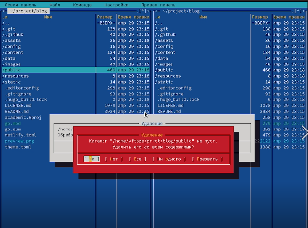
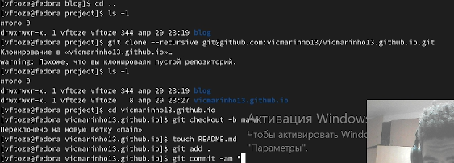

**РОССИЙСКИЙ УНИВЕРСИТЕТ ДРУЖБЫ НАРОДОВ**

**Факультет физико-математических и естественных наук**

**Кафедра прикладной информатики и теории вероятностей**

**ОТЧЕТ** 

**ПО ИНДИВИДУЛЬНОМУ ПРОЕКТУ ЭТАП 1**

*дисциплина:	Операционные системы*	 

Студент:  Тозе Виктор Ф                                   

`	`Группа: НФИбд-02-21                                      

**МОСКВА**

2022	 г.

**ЦЕЛЬ РАБОТЫ**

Размещение на Github pages заготовки для персонального сайта.

Установить необходимое программное обеспечение.

Скачать шаблон темы сайта.

Разместить его на хостинге git.

Установить параметр для URLs сайта.

Разместить заготовку сайта на Github pages.

**ХОД РАБОТЫ**

Установили hugo и скопировали его в файле /bin

у нас теперь последняя версия hugo

После этого создали папку project и клонировал из vicmarinho13 с помощью

Команды git clone - -recursive  и переедем  в каталоге blog

создали наш сайт с помощью команды ~/bin/hugo 

` `удаляем папку /public

`	`Получили силку для нашего сайта но открывается только на этом компьютере 	

так выглядит сайт 

теперь создали репозиторий vicmqrinho13.github.io

на левой стороне проверили что все обновилось 

Теперь снова создали папку public 

вводили МС в терминале и нажали .gitignore

`	`Внутри .gitignore добавили звезд перед public

на данном этапе можно уже открыт наш сайт с помощью силку на любом компьютере 

Получаем такой сайт где мы будем выполнить другие этапы нашего проекта

